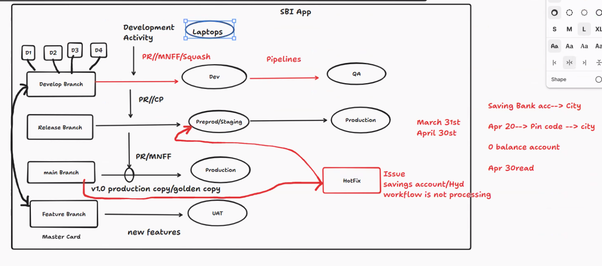

Date: 20-04-2026
Agenda for today

Screenshots: 

Till now, we have seen the process till uploading the code in Github. Now, we'll see the next steps.
All the below phases will be placed in an Environment.
Dev Laptop -> Azure repo/Github Repo -> Build Phase -> Unit Testing -> Code quality analysis -> Code security analysis -> Artifacts -> Deployment Phase -> (Servers, WebApps, Containers, K8s Pods)

Phases of Environments
Test/Dev, QA, PRD

Develop Branch ---> Dev Env, QA Env
Release Branch ---> Preprod/Staging, Production
Main Branch ------> Production
Feature Branch ---> UAT

Develop Branch ---> Dev Env, QA Env
Once the PR is ready, this will be sent to Dev, QA using MNFF, Squash

Release Branch ---> Preprod/Staging, Production
From Develop branch, A PR is raised to Release branch using Cherry Pick

Main Branch ------> Production
From Release branch, a PR will be raised to Main Branch using MNFF and with a tag v1.0. We called this copy a production copy/golden copy

Feature Branch ---> UAT
Once the code is ready in Feature branch, we'll push the code to Develop branch and do the same steps from Develop branch to main branch again

Hotfic Branch
This branch will be derived from Release branch. Once it is ready, push it to main, Release branch and main branch should be updated with a tag

Testings which are done by Tester:
1. Functional Testing: Business logic is working or not. Validate input and output.
2. Integration Testing: UI has to talk to backend. Once the backend proceesses the data, it saves in database. Basically, interaction between different components or not.
3. API Testing: Test multiple APIs are working or not
4. UI Testing: Buttons working or not. Forms are getting submitted or not. Layout is working fine for all devices or not. We use Selenium, Cypress tools for this.

Preprod Testing: Performance testing
1. Performance testing: Load, responsiveness, performance of the systems will be checked
2. Security testing: Vulnerabilities, Authentication, Data Protectoin
3. Load Testing: Simulate multiple users and check the breaking point with a heavy load.

Code Quality: Checks the quality of the code using Sonarqube with no duplicate logics. And it should be clean and efficient.
Code Security: Secured, vulnerability free code

Next class would be on Pipelines - It would be a .NET PRoject and this will be pushed into a Web Apps which are Linux based.

What are the Branching and merging strategies using in your Organisation?
Read this doc: https://www.atlassian.com/git/tutorials/comparing-workflows/gitflow-workflow

What is the difference between Develop branch and Feature branch ?
Development activities which are usual iones will be developed in this branch
Feature branch will be used for brand new features and this will be showed to Customers and get confirmation and then pushed to Develop branch
