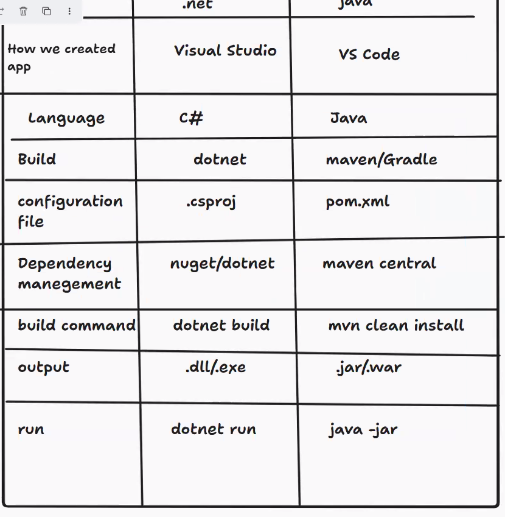
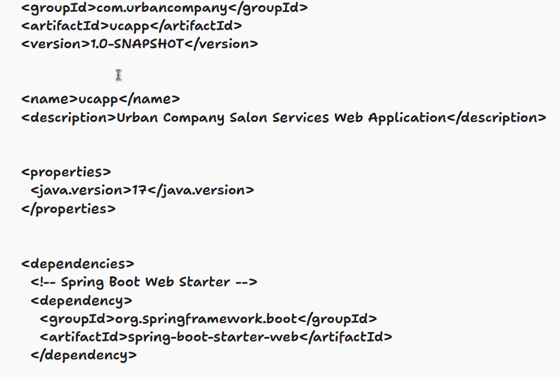

Date: 05-05-2026
Agenda for today

Backend: Dotnet
maven is from apache software
Dotnet vs maven(Java) differences - 
How we created app - Visual Studio(Dotnet), VS Code(Java)
Language used - C#, Java
Build - dotnet, maven(Used for building java apps)/Gradle
Config file - .csproj, pom.xml file
Dependency management - nuget/dotnet, maven central(For downloading dependencies)
Build command - dotnet build, mvn clean install
output - .dll/.exe file, .jar/.war file
To run app - dotnet run, java -jar

Steps
Get the code developed --> Azure repos push ---> Build ---> package it ---> Deploy

maven commands
mvn clean - remove old build, create new build
mvn compile - compiles the code
mvn test - runs the test cases
mvn packages - creates jar file/war files
mvn install - install to local
Maven is a build and dependency management tool

pom.xml contains all project information
information will be in first 3 lines - <group id>com.example</groupId>
<artifactis>
<version>
<properties>

To deploy web application, spring boot is required - 
<dependencies>spriing boot web sterter

<build>

.jar ---> Jar Archive(modern apps)
.war ---> Web App Archive(legacy apps)

