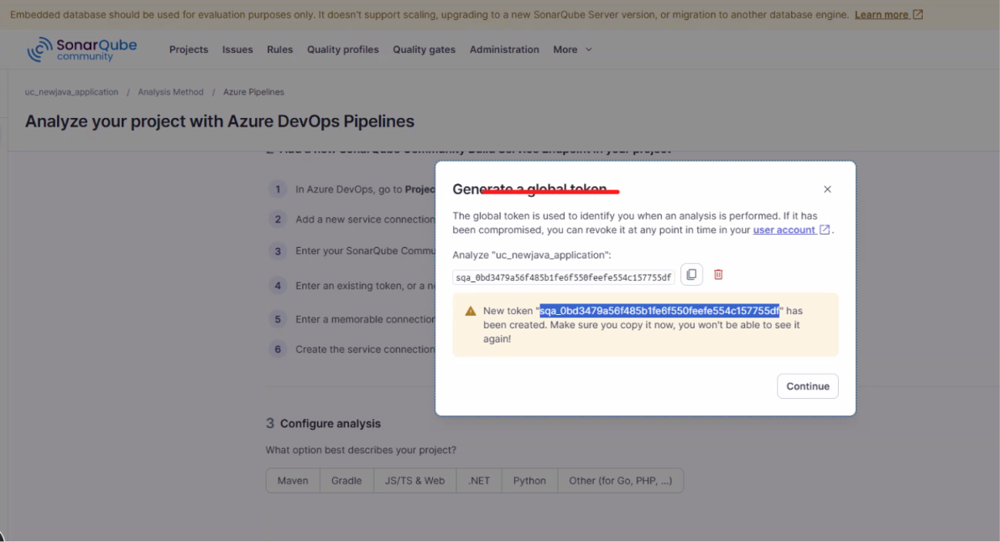
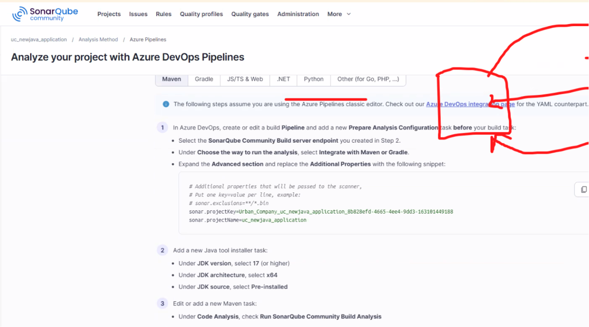

Date: 12-05-2026
Agenda for today

Bring the java app to azure repos
From azure repos, we setup pipelines and deploy it to Webapp
We will install sonarqube in this class

Build code in pipelines.iyml
deploy to WebApp
expand this to other environments as well

Sonarqube: Continuous Inspection
This will highlight bad code practices, duplicate logic, unused variables, security hotspots
Vulnerabilities, bugs will be highlghted by Sonarqube and generate a report

Now, we have to insert a layer in between Azure Devops and Azure Cloud
Azure DevOps --> SonarQube --> Azure Cloud
We can integrate all these using service connection

Next topics
1. Create VM
2. Install docker
3. Install SQ
4. Add SQ to our Azure Devops
5. Extensions -- >

Steps to install Sonarqube on a Virtual machine:
sudo apt update
sudo apt install apt-transport-https ca-certificates curl software-properties-common -y
curl -fsSL https://download.docker.com/linux/ubuntu/gpg | sudo apt-key add -
sudo add-apt-repository "deb [arch=amd64] https://download.docker.com/linux/ubuntu bionic stable"
sudo apt update
sudo apt install docker-ce -y

systemctl enable docker
systemctl start docker
docker --version
docker ps
Till now, docker is installed. Now, lets install Sonarqube as a container
docker run -d --name sonarqube -e SONAR_ES_BOOTSTRAP_CHECK_DISABLE=true -p 9000:9000 sonarqube:latest

Configure the Sonarqube in this website Public IP:9000
The above step is to configure teh Azure Devops in Sonarqube

Now, lets install the Sonarqube extension in Azure Devops so that two way connection is made
In Azure DevOps
Project Settings --> Service Connections

Generate a Token from Sonarqube to authenticate

Next step is Configure : 

