Date: 25-04-2026
Agenda for today

Created code and pushed the code to Azure repos. From here, we have configured CI Pipelines alone.
In CI Pipeline, We have configured an agent to do the tasks.
We have a Nuget package manager, built the project, Published, Generated a zip file(Drop location)

Deploy task --> zip --- Web Appp(PAAS Service from Azure)

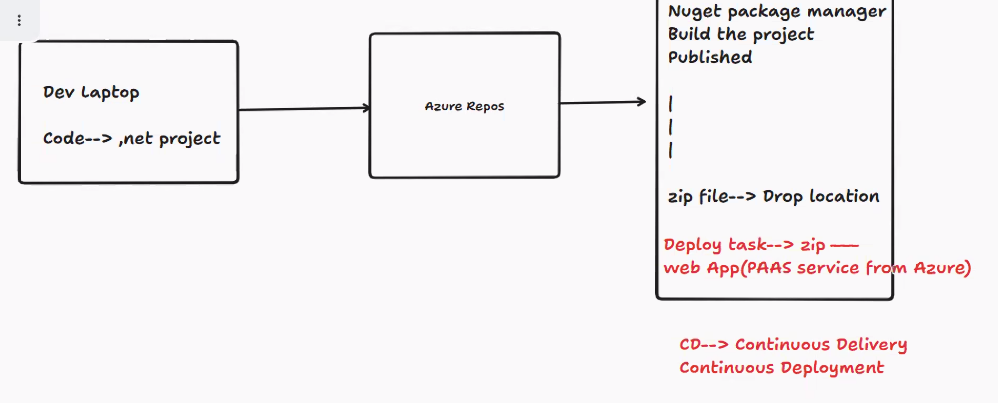

Today's topic - Continuous Delivery and Continuous Deployment
We will push the changes to Dev, QA, Staging, Pre prod, Production
Here Dev, QA, Staging are Lower Environments
Pre prod and Prod are Higher Environments
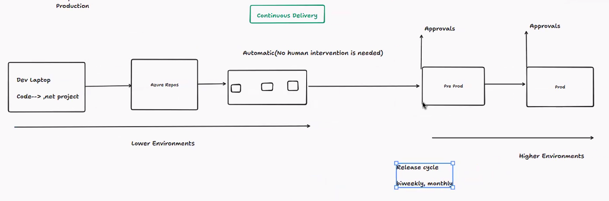
In Continuous Delivery, we will have approvals. Things happen in manual mode.

In Continuous Deployments, we will have gates(Waiting period)
In this, no human intervention is required. Everything is automatic.
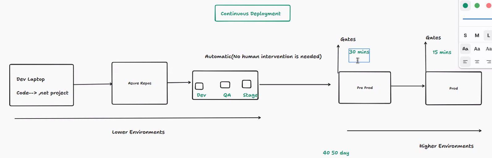

Diff between both CD/CD is Gates, approvals

Webapp applications are nothing but apps on App Service Plan(Platform/Framework)
We have differnet plans in App Service Plan - Basic, Standard, premium
We can run multiple WebApps, Containers on App Service Plan

Now, we have code for web application in Azure Devops. We will try to push those changes to App Service plan with Windows OS.
So, Lets create Web app and App Service plan
For Web App, the URL looks like ucsaloon.azurewebsite.net
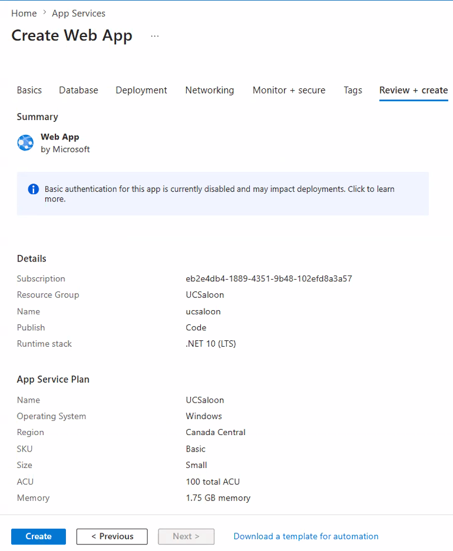
App Service Plan is already created

What are we trying to do?
We are trying to push the code to App Service Plan
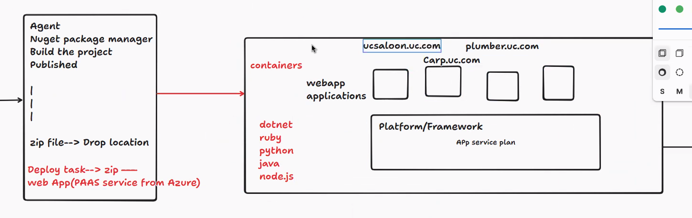

once the Azure Web App and App Service plan is depoloyed... Create a Service Connection in Azure Devops
In tasks section, Seclect Azure App Service Deploy Settings looks like
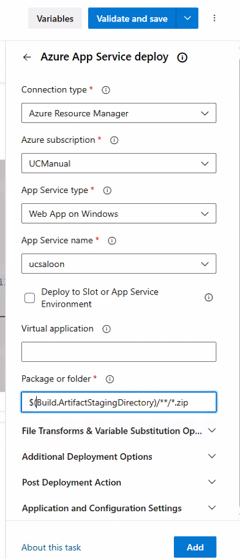
Result looks like this in Pipeline - 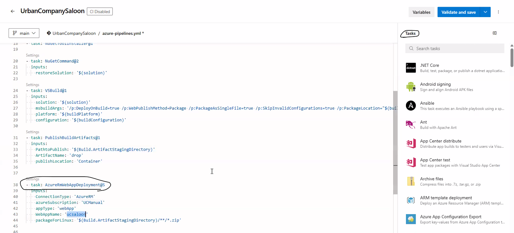
AzureRMWebAppDeployment task is added now in pipeline

Now, lets setup Godaddy for DNS Resolution
Mapping Domain name to IP Address is called A Record
To verification, txt record id created, Domain verification/Security
fb.com, facebook.com, ip -> Canonical Names since all are similar. Think this as Alias.

TZT Record Explanation - 
URL to IP Address. This conversion needs to verify domain. This authentication token is created to verify if the domain name requested is genuine.

Godaddy setup
devopsatvedinc.com is the URL we will provide to the user.
Custom Domains section in Azure WebApp/Settings/Custom domain
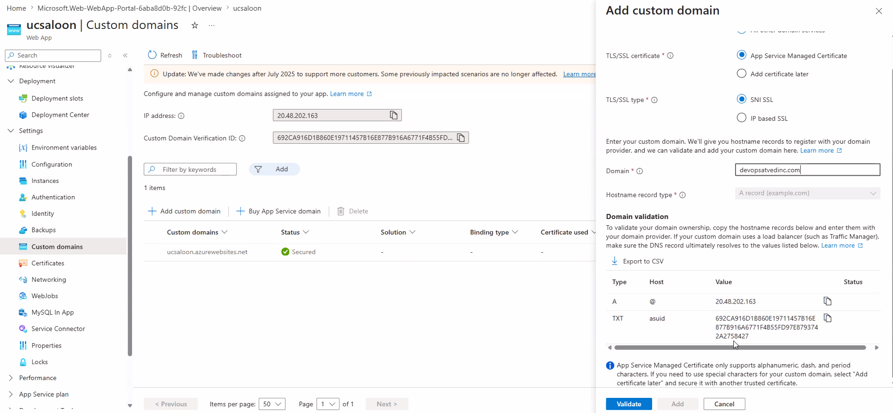 - Generated A Record and TXT Records needs to be placed in GoDaddy 
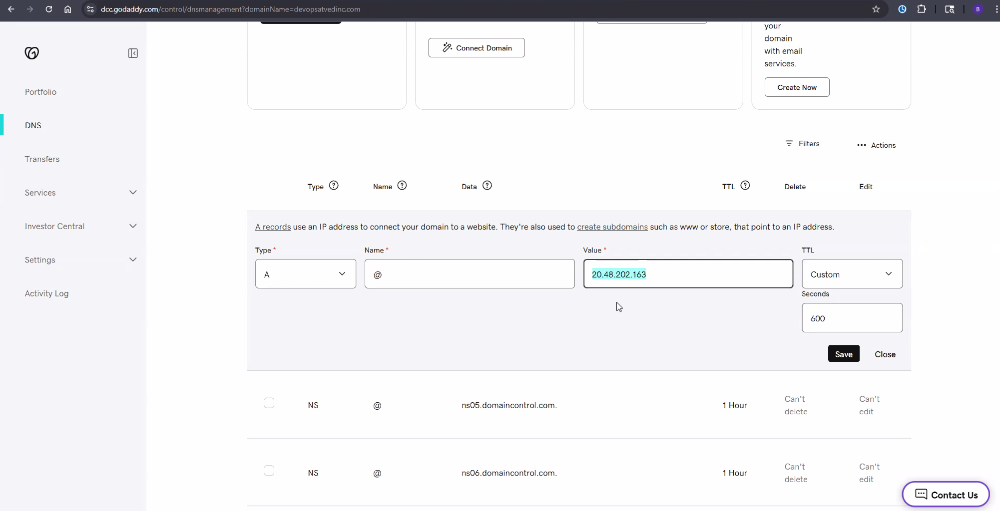
TXT Record Updated
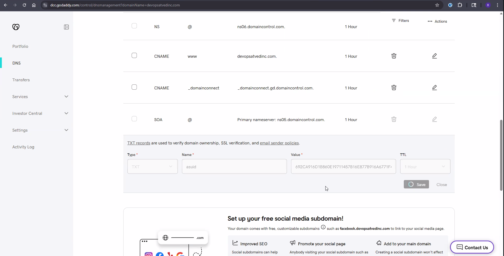

Where do we setup the port number of localhost to host the Web app ?
Inside Properties/launchsettings.json - 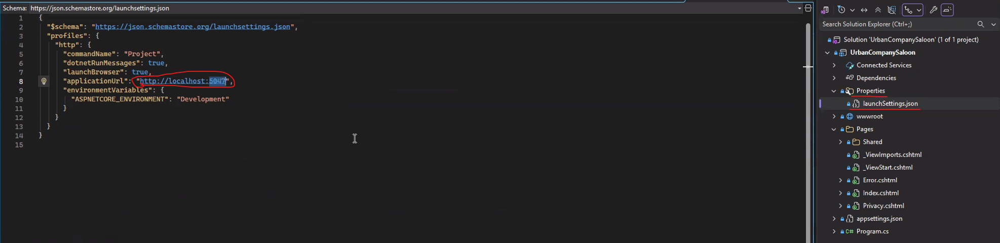

Today, we have worked to write this code snippet to enable a service connection from Azure Devops repo to Azure WebApp
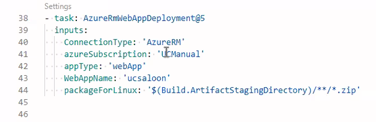

Today's Flowchart - We have deployed the resources manually till today. Tomorrow, we will be using Bicep.
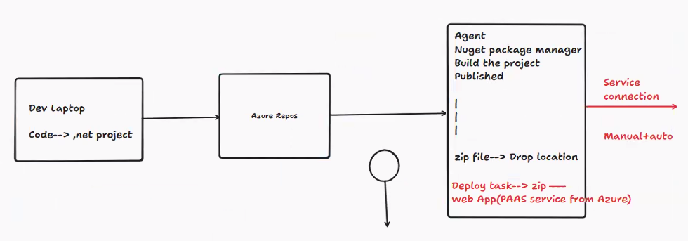

Tomorrow's plan is to write a Bicep task
In Bicep task - Infra Building will be taken care automatically and the Webapp will be deployed in WebApp Service
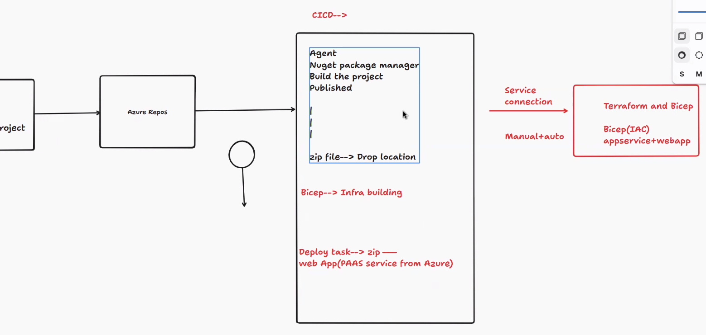

If we have 2 WebApps with different functionalities.
One to print PDf, another for vie PDf. For specific service like view. Function app is used.

All the encryption of Information which goes to and fro between remote and browser will be handled by SSL Certificates.

