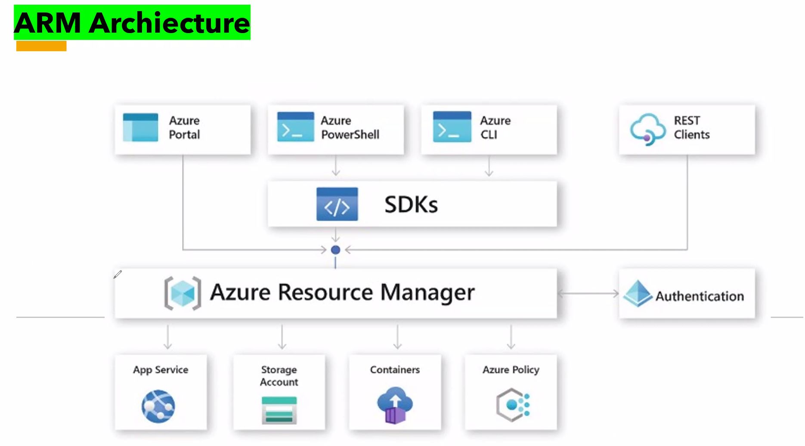
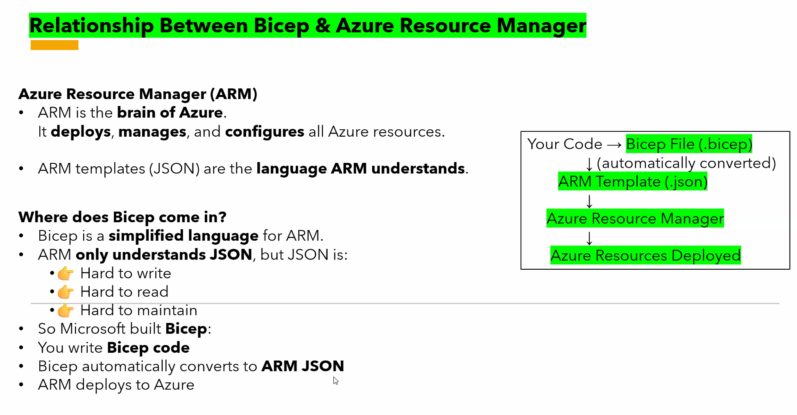
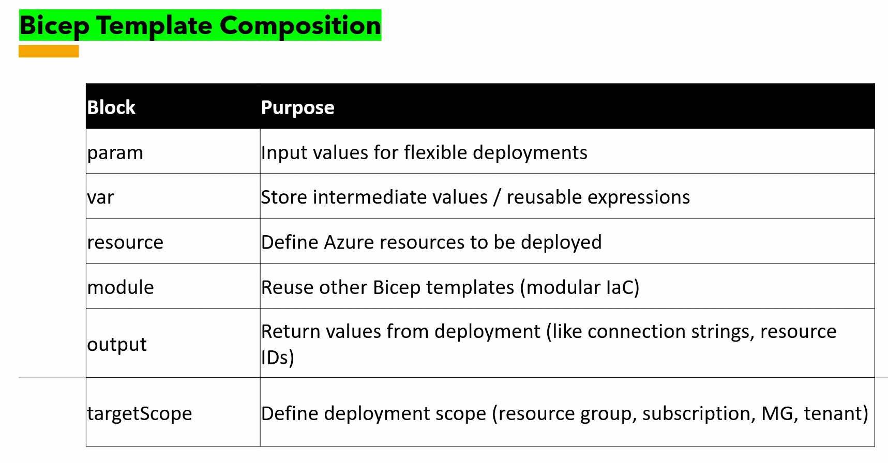
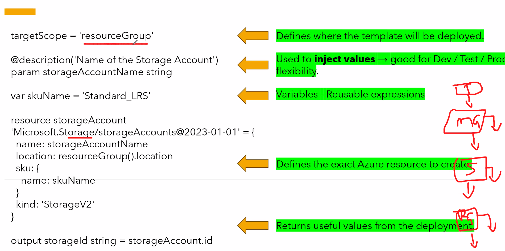

Date: 24-04-2026
Agenda for today

So far, we have progressed in deploying the resources in Portal manually
In this session, we will deploy resources automatically
In order to deploy automatically, We will use Infra as a Code Languages
3 options we have are:
1. Terraform
2. Bicep(Only for Azure) --> Azure ARM Templates(Deprecated)
3. Cloud Formation --> AWS

ARM Architecture - 

Azure resource manager is a very powerful Middleware solution. All the requests made from Azure portal, Azure Powershell, Azure CLI, REST Clients will be performed by Azure Resource manager. Next, once the requests reach ARM... It will authenticate whether we have permission or not to perform the actions.

Bicep
It is a Domain Specific Language for Azure. Earlier, we have ARM Templates.
Bicep will Transpilated(Converting Bicep to JSON) to JSON Templates. As ARM only understands JSON.

Your code(Bicep file -> .bicep) --> ARM Template(.json) --> Azure resource manager --> Azure Resources Deployed - 

Bicep Template Composition - 

param - There is a slight diff between param and var -> Once the program has run, our terminal will request for few values... that is called param. 
var - We can hardcode or store values in some variables and be utilized later is called var.
resource - Which resource type should be deployed in Azure
module - We can reuse other Bicep template. Then, we can use module.
output - Return values from deployment
targetScope - We should define what are we deploying

Bicep template Example - 

In order to use Bicep templates, we need to install Azure CLI, Bicep extension. In VS Code, we need to install Bicep extension.

YAML language is used by Ansible Tool
Ansible is a Configuration management tool
Terraform is used to provision resources in Cloud
