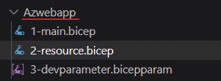
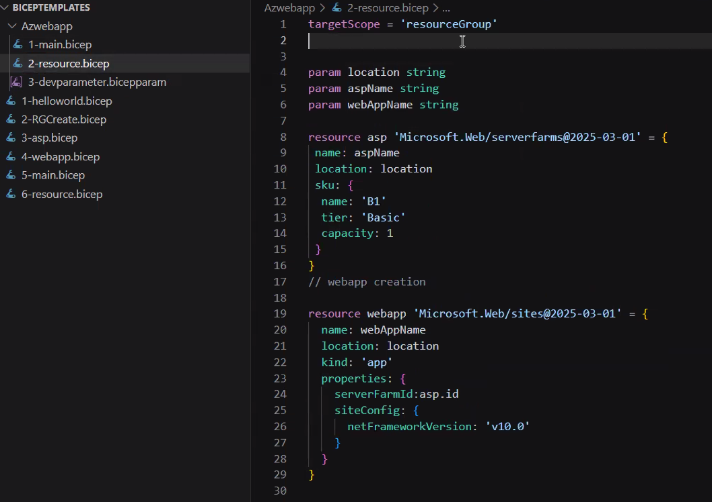
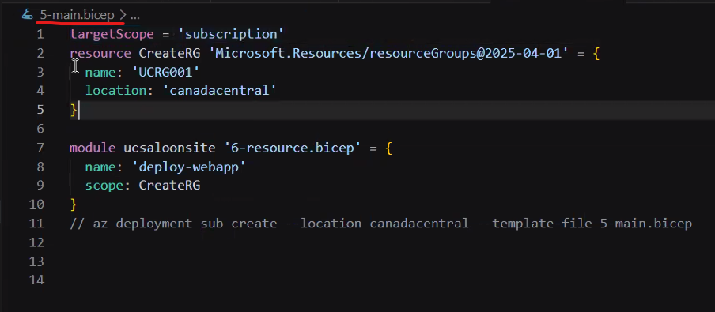
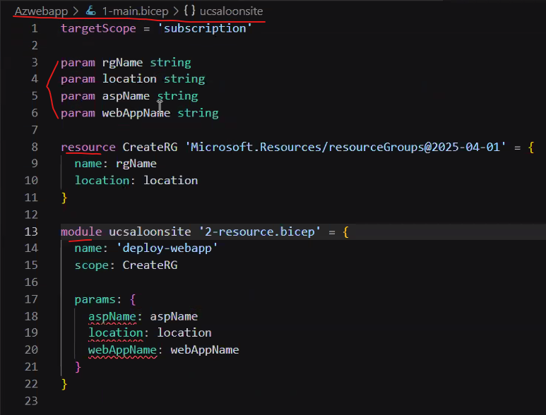
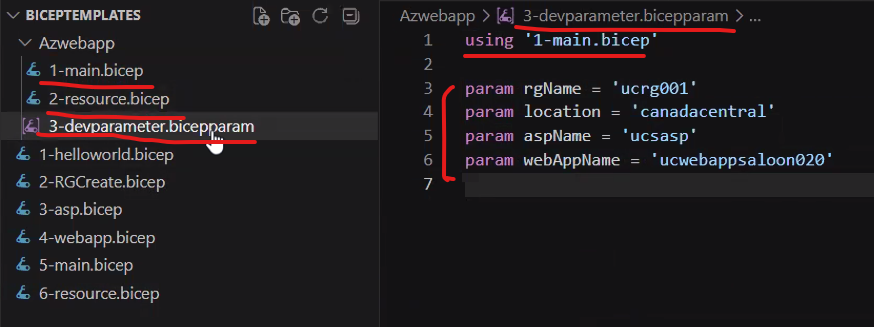

Date: 04-05-2026
Agenda for today

Lets understand how to avoid hardcoding in this class
we have to create a new file with .bicepparam extension in the project structure - 

2-resource.bicep - 

3-devparameter.bicepparam

How to reference in main.bicep()
targetScope = 'subscription'

param rgName string
param location string
param aspName string
param webAppName string

resource CreateRG 'Microsoft.Resources/resourceGroups@2025-04-01'= {
    name: rgName
    location: canadacentral
}

Rest of the code: Check in screenshot

the Structure of the project should be changed like this - 

NOTE: We have to declare all the parameters that a deployment needs
NOTE: Modules are isolated and cannot see parent variables automatically

Sequence how bicep templates will run
First .bicepparam will run ---> next main.bicep ---> Next modules ---> Next resources will be run
Precedence is having for the explicitly mentioned parameters

To run the script, login to Azure --> az login --use-device-code
az deployment sub create --location canadacentral --template-file .\1-main-bicep .\3-devparameter.bicepparam
The above is used to deploy the resources using CLI/Powershell

NOTE: If the resources are already deployed in Azure, Bicep will skip them even though if you ask it to deploy again.

Now, the next part will be about deploying using pipelines
Look at the video for the steps.

Web App - It will be shown as App Service in Azure Portal
App Service Plan - It will be shown as App Service Plan in Azure Portal

Types of Artifacts -
1. Build Artifacts
2. Pipeline Artifacts
3. Deployment Artifacts

