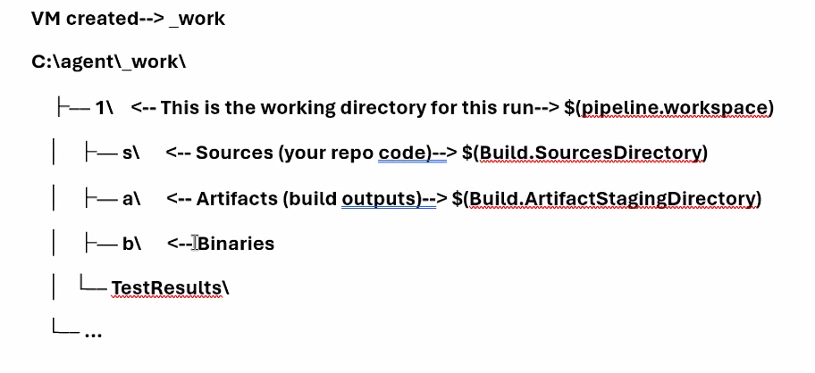
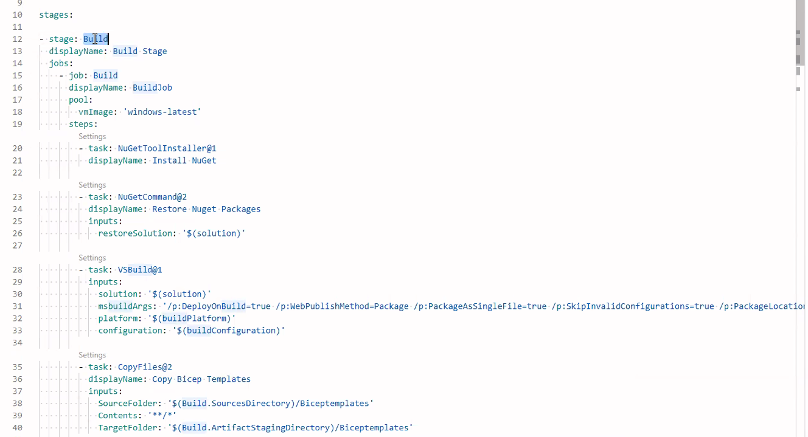
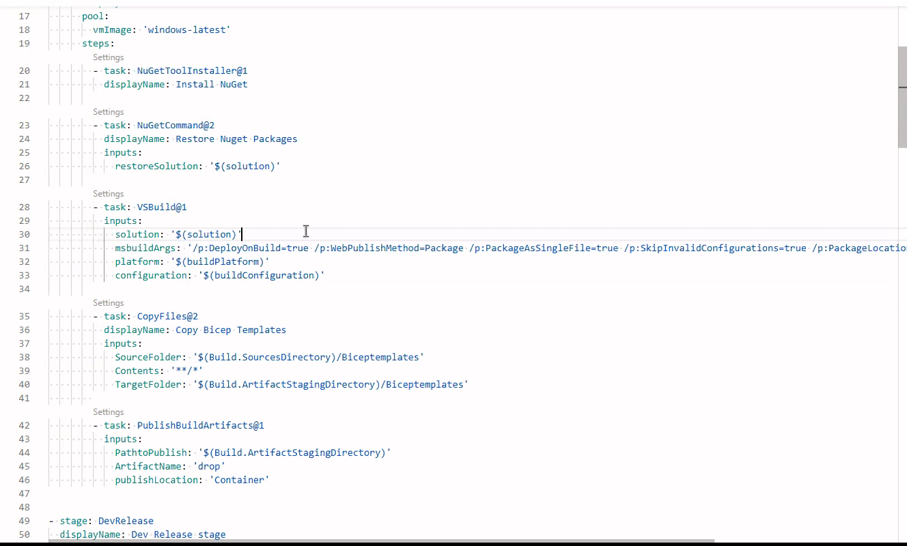

Date: 05-05-2026
Agenda for today

YAML

YAML-Based Multi-Stage Pipeline in Azure DevOps

1. Introduction to YAML in Azure DevOps
YAML (YAML Ain't Markup Language) is used in Azure DevOps for defining Build and
Release pipelines as code. This promotes consistency, version control, and automation.

2. Pipeline Components Overview
a. Stages
Stages are logical groupings of jobs. In a multi-stage pipeline, each stage can represent a
different phase (Build, Test, Release).
b. Jobs
Each stage can have one or more jobs. A job runs on a specific agent and contains one or
more steps.
c. Steps
Steps are individual tasks such as running a script, installing a package, or deploying an
application.
d. Variables
Variables help you define values that are reused throughout the pipeline.
e. Pipeline Workspace
The pipeline workspace is the directory used to store files and artifacts during pipeline
execution.
VM created -- > work
C:\agent\_work\
-1\ <-- This is the working directory for this run -- > $(pipeline.workspace)
-sl <-- Sources (your repo code) -- > $(Build.SourcesDirectory)
-al <-- Artifacts (build outputs) -- > $(Build.ArtifactStagingDirectory)
-b\ <-- Binaries
TestResultsl
...

Code will reach first to s\
Output will be stored in a\ - ArtifactStagingDirectory
Binaries will be stored in b\

3. Lifecycle Hooks in YAML

Lifecycle hooks are custom scripts or actions that are executed before, during, or after
deployment.

preDeploy:
- script: echo "Starting Apache"
deploy:
- scrIpt: echo "Deploying Application"
postDeploy:
- script: echo "Restarting Apache"
on failure:
- script: echo "Deployment Failed"
On success:
- script: echo "Deployment Succeeded"

Types of Hooks:
Pre-Deployment: Start services, validate prerequisites
Deployment: Deploy your application
Post-Deployment: Restart services, notify users

4. Deployment Strategies
a. Run Once
Simplest strategy. Executes lifecycle hooks once.
b. Rolling
Deploys to a few VMs at a time. Ensures high availability during deployments.
c. Canary
Deploys to a small subset of seryers first, tests them, and then deploys to the rest. Used for
safer releases.

Create a DotNet project using vibe coding to create
Create Bicep template
Create Pickle Repo
Build -  - 
Dev
QA - Have Time delay of 2 mins
Prod - Have Time delay of 2 mins

NOTE: Use Copy step for Bicep templates files from Agent to Drop.
We use dedicated Agent pods for each stage.
We can get external plugins(Like Sonarqube, Slack, Microsoft teams) from Visual Studio Marketplace/AzureDevOps -

