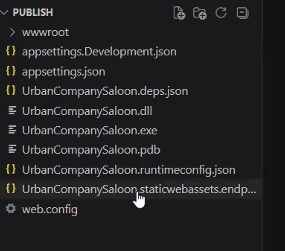
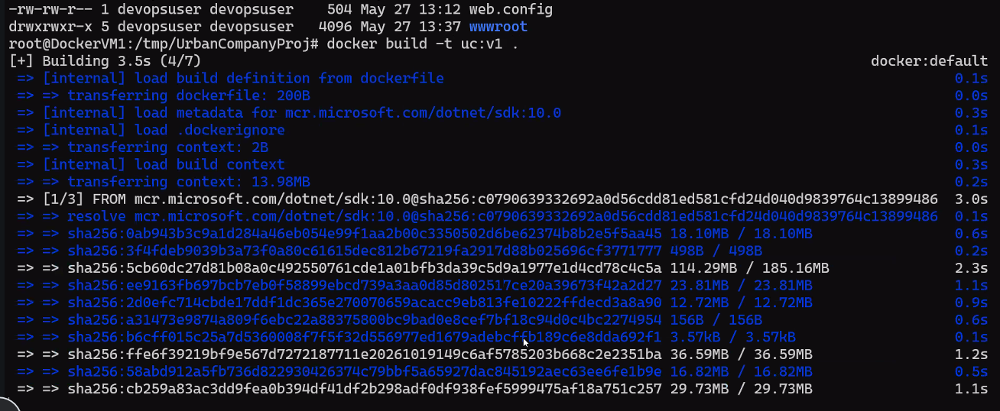
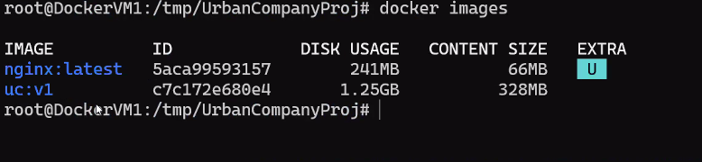
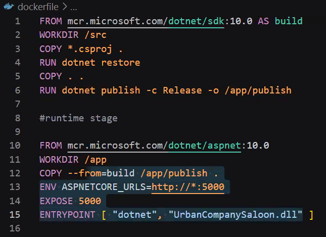
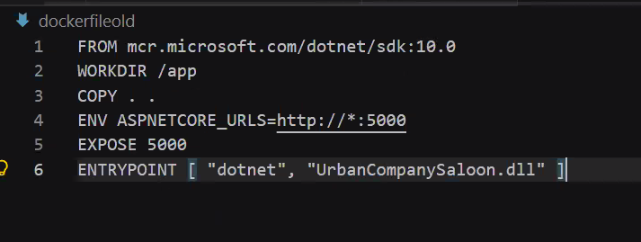

Date: 27-05-2026
Agenda for today

How to use persistent volume of a linux to a container
Create Custom container
Create Multi Stage container

Containers cannot store the data because volumes are non persistent
SO, as soon as the container is restarted.. The data is wiped of.
Solution for this is... Mount a persistent volume to the container... Persistent(kind of storage even after restart, the data will stay)

Command to install Docker inside a Virtual Machine with sudo permissions is:
curl -fssl https://get.docker.com | sh

root@DockerVM1:/home/devopsuser# docker run -d --name mynginx -v /home/devopsuser:/usr/share/nginx/html -p 80:80 nginx
The above command is not working since /home/devopsuser is not having access

Actual command that worked
root@DockerVM1:/tmp/html# docker run -d --name mynginx -v /tmp/html:/usr/share/nginx/html -p 80:80 nginx
-d ---> Detacched mode
--name --> Name of the container
-v --> Persistent Volume
-p --> Port Mapping
nginx -> Which Image to run in the container

dotnet publish .\appname.csproj -- > Builds the project
csproj file the main project file
.dll
dotnet appname.dll

Custom Container
Once the publish folder is created after Build command is run... 

Now, we need to create a Dockerfile
You have to create a Runtime Environment in the container
We will have Instructions(All Instructions are case sensitive. So, all should be in capitals) and Arguments
FROM      dotnet/sdk:10.0 ---> Image that needs to be downloaded
WORKDIR   /app
COPY . .
ENV ASPNETCORE_URL=http://*:5000
EXPOSE 5000
ENTRYPOINT ["dotnet", "UrbanCompanySaloon.dll"]

. -> laptop location
. -> Working Directory in container

To build a Custom container image - 
Image looks like - 

Create Multi Stage container
Stage 1 - Tools to build .dll
Sequence what we have followed till now: App is built, with this .zip is created
From the zip, .dll file is created

Stage 2 - Tools to get Runtime Environment
aspnet image ---> Run time environment
.dll --> We will copy the .dll file from Stage 1 to Stage 2

docker build -t uclightweight:v1 .
The above command is used to build an image

Multi Stage Docker file - 
We are building in Stage 1 and 
FROM mcr.microsoft.com/dotnet/sdk:10.0 AS build
WORKDIR /src
COPY *. csproj .
RUN dotnet restore
COPY .
RUN dotnet publish -c Release -o /app/publish

#runtime stage

FROM mcr.microsoft.com/dotnet/aspnet:10.0
WORKDIR /app
COPY -- from=build /app/publish
ENV .ASPNETCORE_URLS=http:// *: 5000
EXPOSE 5000
ENTRYPOINT [ "dotnet", "UrbanCompanySaloon.dll" ]

Old Docker file - 
We are giving the .dll file which is created after the Build phase is completed

Explanation:
dotnet restore means - installs all the required packages of .csproj
Dockerfile placed location(Laptop/Linux machine) to Container's Working Directory

Web app is a paas service from Azure

Doubts
what is -c Release ?

What is the reason for the reduction of size ?

Internal porting - 80
External porting - 5000
didn't understand

Ports are confusing
What is Compile, Build, Run, Publish