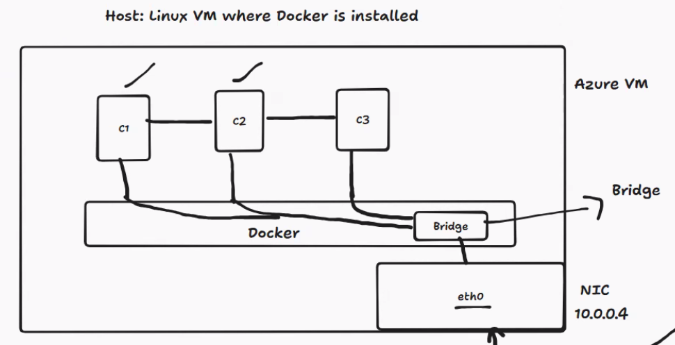
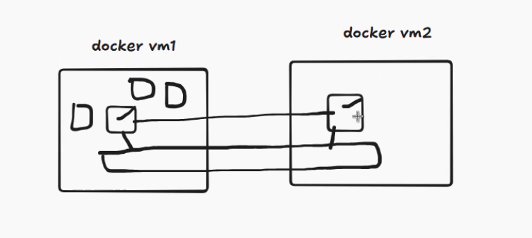

Date: 01-06-2026
Agenda for today

Docker Network - 

Available Networks command
root@dockervm:~# docker network ls
NETWORK ID     NAME      DRIVER    SCOPE
06e690198471   bridge    bridge    local
3a04a6cd4893   host      host      local
515d7c90e3af   none      null      local
root@dockervm:~#

By default, all networks comes under bridge network

We have eth0 for every VM - 10.1.0.4(This is the NIC Card IP)

Virtual interfaces will be created for each of the container to reach the other container in another network

Lets create 2 containers and check if both the containers are able to communicate.

-d ==> Detacched mode. 
-a ==> Attached mode
-it ==> Interactive mode

To create nginx container
docker run -d --name nginx1 nginx

To create Ubuntu container with Ubuntu OS in interactive mode

To install all the tools in Ubuntu container
apt install iputils-ping curl net-tools -y

To connect to any container
docker exec -it nginx1 bash
docker exec -it ubuntu1 bash

curl - this browses the other site
ping - calls and expects a response

 docker run -dit --name secure-ubuntu --network secure-network ubuntu bash

We have another concept called Host network if you want to use the eth0 IP(VM IP) as the container IP
create a container with host network

A service which runs all the others processes is called Daemon service

Overlay Network ---> Will be discussed with K8s concepts

Communication between two VMs and form a secure network

Alpine Images are the images with removing all the unneccessary packages and libraries

Practice - Multi stage container pipeline

root@dockervm:~# history
    1  curl -fsSL https://get.docker.com | sh
    2  docker ps
    3  docker network ls
    4  clear
    5  docker run -d --name nginx1 nginx
    6  docker exec -it nginx1
    7  docker exec -it nginx1 bash
    8  docker network ls
    9  docker network create secure-network
   10  docker network ls
   11  clear
   12  docker run -dit --name secure-ubuntu --network secure-network ubuntu bash
   13  docker ps -a
   14  docker exec -it secure-ubuntu bash
   15  clear
   16  docker inspect secure-ubuntu
   17  docker exec -it secure-ubuntu bash
   18  docker run -dit --name secure-ubuntu --network secure-network1 ubuntu bash
   19  docker run -dit --name secure-ubuntu --network secure-network ubuntu1 bash
   20  clear
   21  docker network ls
   22  docker run -d --name host-nginx --network nginx
   23  docker run -d --name host-nginx --network host nginx
   24  docker ps
   25  docker inspect host-nginx
   26  curl http://localhost
   27  docker ps
   28  docker exec -it host-nginx bash
   29  history
root@dockervm:~#

root@dockervm:~# history
    1  docker run -it --name ubuntu1 ubuntu bash
    2  dockre ps
    3  docker ps
    4  docker ps -a
    5  docker inspect nginx1
    6  docker inspect Ubuntu1
    7  docker inspect ubuntu1
    8  docker start ubuntu1
    9  docker inspect ubuntu1
   10  dockre ps
   11  docker ps
   12  docker inspect ubuntu1
   13  docker exec -it ubuntu1 bash
   14  docker network inspect bridge
   15  docker network inspect secure-network
   16  clear
   17  docker network connect secure-network nginx1
   18  docker inspect nginx1
   19  docker exec -it secure-ubuntu bash
   20  history
root@dockervm:~#

