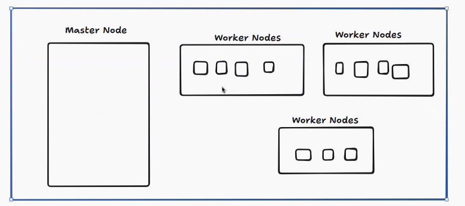
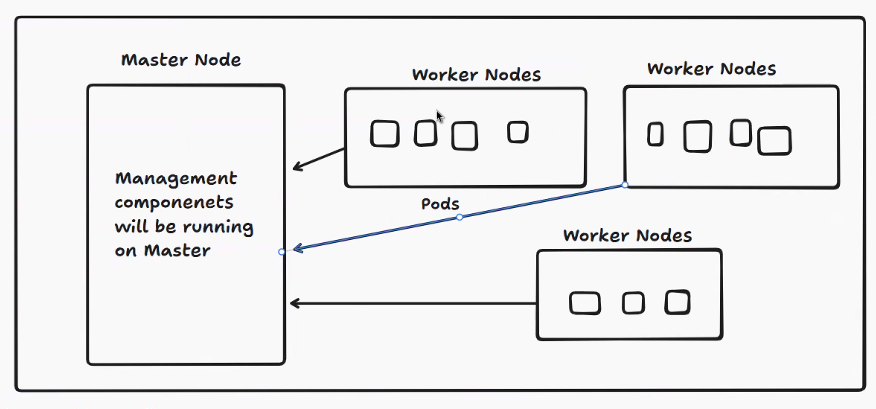
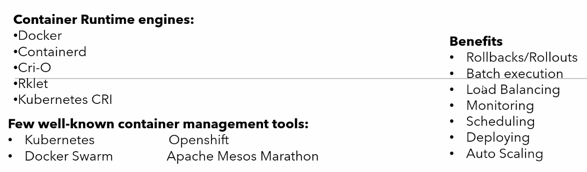
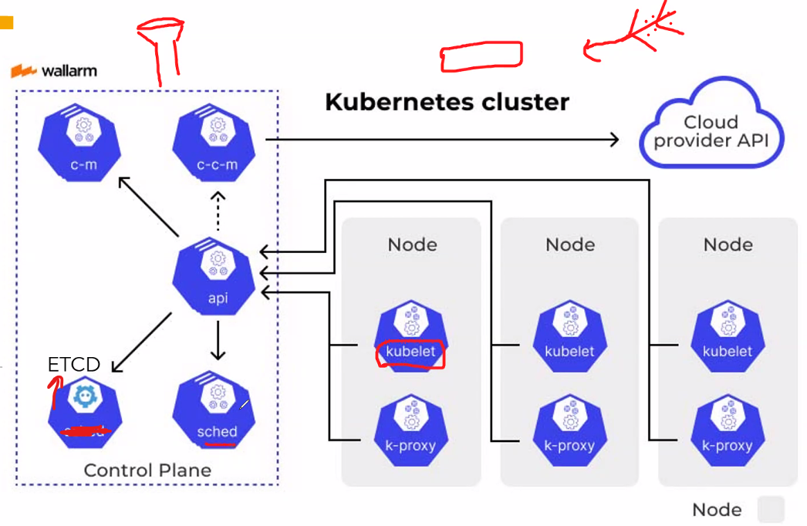

Date: 02-06-2026
Agenda for today

Kubernetes

We might get few challenges in this
We can manage 4 to 5 containers by Docker. But, if you want to maintain 1000s of containers, it is difficult to manage the containers.
In docker, we hardly have to run the containers in Docker. But, in order to recreate in case of any issues to the current Docker container is not there. Basically, there is no auto healing. Then comes the Kubernetes.
Docker is lacking in these features - Scale up/down, auto heal, updates, networking and storage
Solution for above problems is Kubernetes which is Container Orchestrator.
Kubernetes doesnt have capability to run the container but has capability to manage the containers
K8s was developed by Google. CNCF is a foundation which is being managed by them.
K8s was written in GO Language.
K8s can be run in Any linux machine.
Docker has other alternatives like containerd, cri-o(K8s initiative)

In K8s, we call container as Pods. In container, we can run only one application runtime unit.
Pod is a wrapper in K8s. In pod, we can have one or more containers.

Container management is a process for automating the creation, deployment, and scaling of containers.
Container management facilitates the addition, replacement, and organization of containers on a large scale.

In pod, we have multiple containers where we have one as main container and the other containers are called sidecar containers. Sidecar containers will usually do monitor, encrypt/decrypt

Few well-known container management tools:
1. Kubernetes
2. Docker Swarm
3. Openshift
4. Apache Mesos Marathon
Docker compose is only used to just start multiple containers in a sequence.
Docker compose is Kubernetes Competition. Scale up and scale down feature is not available in compose. So, we use Docker Swarm.

K8s Architecture

api server/component - Entry point for your application
scheduler - Checks which node is free to work
etcd - Is a database where each command will be shared by other components
control manager - Core component which manages the requests and will ensure that the command is properly running or not in the particular node.
Cloud control manager is the one which communicates with all the Cloud providers like Azure, AWS, GCP

In Worker Node, 
kubelet is the one which starts the Node
k-proxy will manage all the network related queries

Deployment methods
1. Master node + Worker node on a single VM
2. AKS
3. Complex with master and worker nodes - Most economical and flexible

Master node will be managed by Azure. Worker nodes were also managed by Azure. We will have GUI to manage the systems

In rules, all the configurations will not be configured at Node Level. They'll most probably at master node.

Node effinity - We can define the selected node should run for this task
Taint - Do not run this application on specific node, then it is called Taint
Stateful
Stateless

Kubernetes upgrades are very tough and will be discussed in the later sessions
