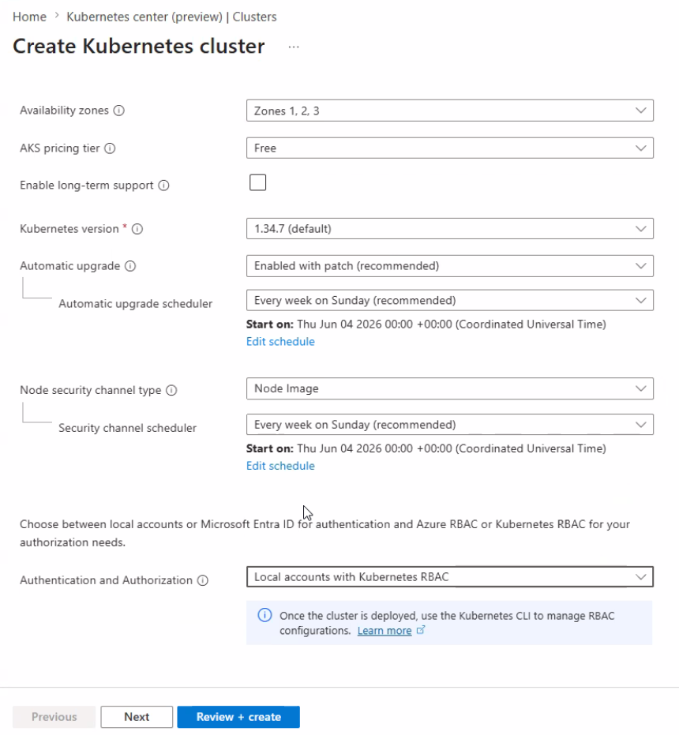
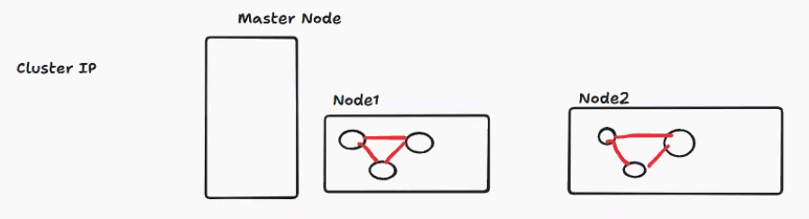
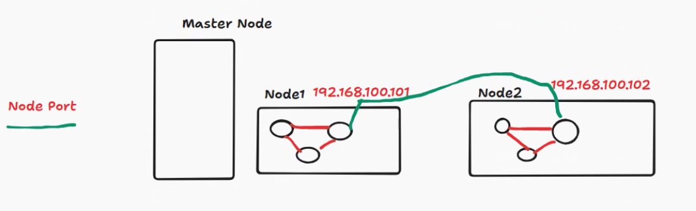
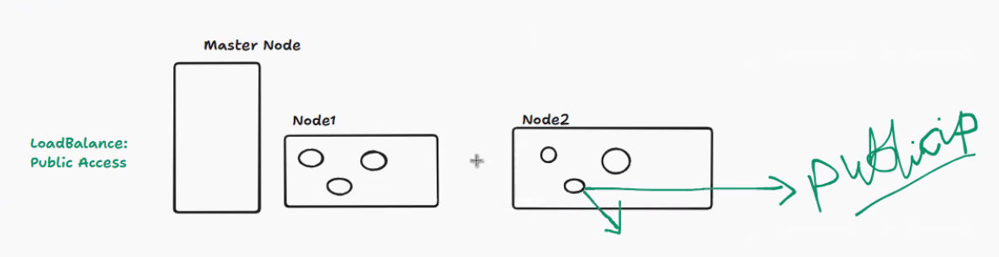
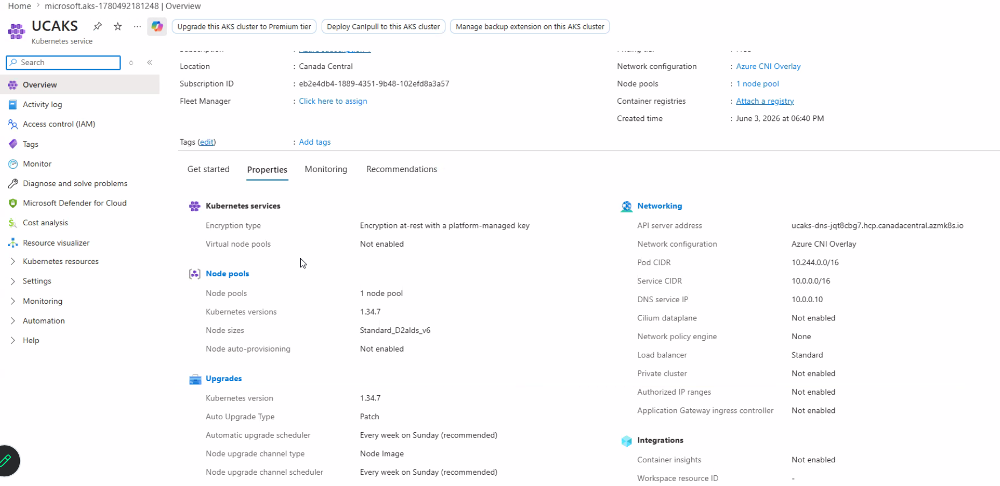
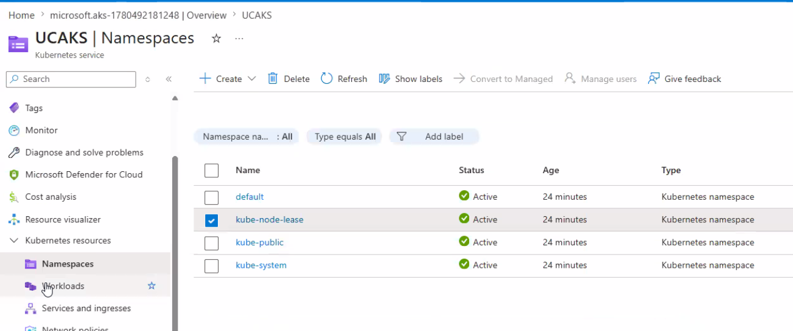
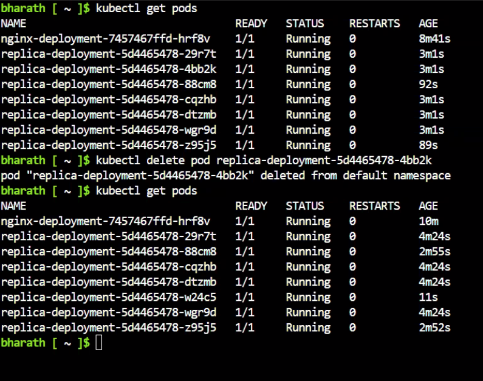

Date: 03-06-2026
Agenda for today

AKS

In AKS, management of the Master node is free but management node is paid
Node pool is group of Worker Nodes

Cluster is group of Master and worker nodes
Node pool is group of Worker Nodes
Node is group of Pods
Pod is group of Containers
Fleet manager - This will manage multiple Clusters

Create Kubernetes Cluster(AKS Manual) - 

Create --> deploy

Deployment: --> I want 3 copies of my application, always running and no downtime
no of pods, scale, replica sets, Image(nginx, uc custom image), Upgrades(rolling, canary, Blue green)

Service: Networking -- > how pods are communication(internal, external) -- > expose your application to the Network
Cluster IP
Node Port
Load Balancer

If cluster IP is provided, the pods will communicate internally within the same worker node. Worker Node 1 cant communicate to Worker node 2

If Node Port is provided, one pod in Worker Node 1 will communicate to another Pod in Worker Node 2

If Load balancer is provided, public access is provided to one of the Pod in Worker Node for having Public access - So, public IP address will be given

One cluster is created in AKS today - 

Kubernetes Namespaces are by default created

Workloads

Deployment can be defined in Imperative way and Declarative way
Imperative: Command based
Declarative: File creation with commands
For Cluster commands, it starts with kubectl
kubectl create deployment nginx-deployment --image=nginx
kubectl expose deployment nginx-deployment --port=80 --type=NodePort

In each Pod, one container is created

It will allocate network to your pods - Weave net
