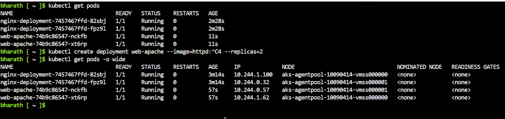
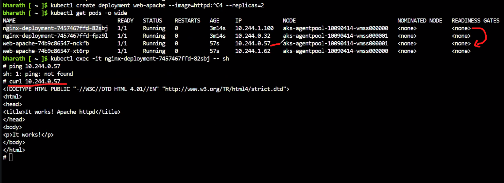
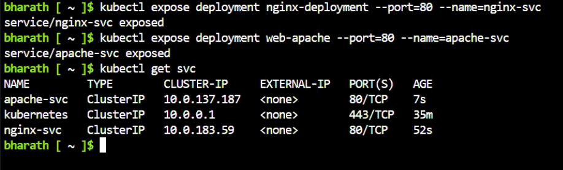
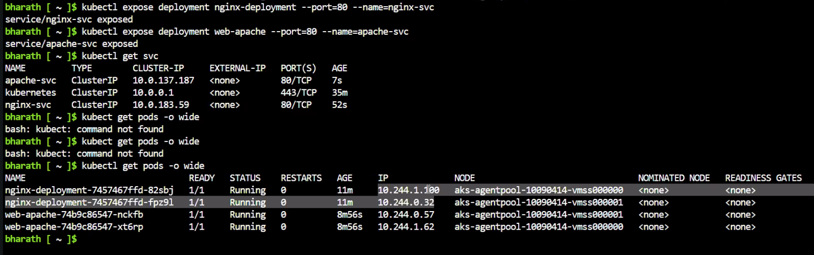
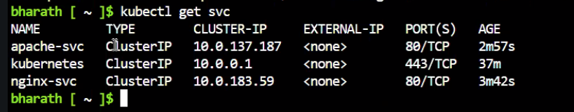
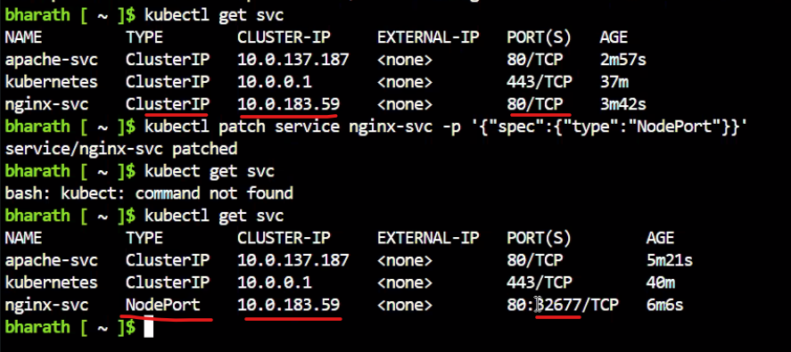
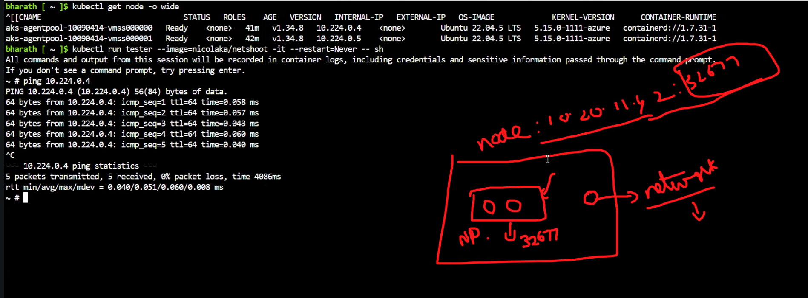
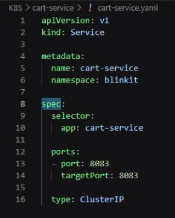

Date: 08-06-2026
Agenda for today

Node Port

Assigning Public IP is very tough. So, we use Azure CNI for assigning Public IPs to Azure AKS.

Creating a Deployment with 2 replicas of nginx image and naming that deployment as nginx-deployment
kubectl create deployment nginx-deployment --image=nginx --replicas=2

Creating httpd with 2.4
kubectl create deployment web-apache -- image=httpd:2.4 --replicas=2

kubectl get pods

To get individual pod IPs
kubectl get pods -o wide - 

To start a Pod... use kubectl exec -it nginx-deployment-745675678567-82sbj -- sh
Tested pod to pod communication internnally. It worked.

If we dont specify any IP, it will pick Master Node's IP which is Cluster IP
kubectl expose deployment nginx-deployment --port=80 --name=nginx-svc

Assigning network to a deployment is called Service

Providing Pod to Pod communication and checking if Cluster IP is being used or not - 

Get the list of services - kubectl get svc

To change Cluster IP to NodePort, we run this patch command
kubectl patch service nginx-svc -p '{"spec":{"type":"NodePort"}}'

To check the status of node level
kubectl get node -o wide

Connecting from Pod to Node

To change Cluster IP to Load Balancer, we run this patch command
kubectl patch service apache-svc -p '{"spec":{"type":"LoadBalancer"}}'
service/apache-svc patched - This means service is changed to LoadBalancer

Once a service is created, a yaml file will be created.

cart-service.yml has the below code
apiVersion: v1
kind: Service

metadata:
    name: cart-service
    namespace: blinkit

spec:
    selector:
        app: cart-service

ports:
    -port: 8083
    targetPort: 8083

    type: ClusterIP

Cluster IP will be for sure to communicate internally
Only in the case of Load balancer we will get External-IP

We should be able to create these files by the end of these classes
1. deployment
2. service
3. configmaps
4. statefullsets
5. replica sets
6. bluegreen, rolling, canary upgrade
7. secrets
8. ingress
Prepare One file which will contain all the possibilities mentioned above

Calico is one of the CNI... This provides Public IPs to the Infra

32677 is the Node Port. 80 is the Service port for internally. 32677 is the port for externally.

Load distribution's concept is for VM Load balancer. But here, giving the scope for nodes to get public network access.

