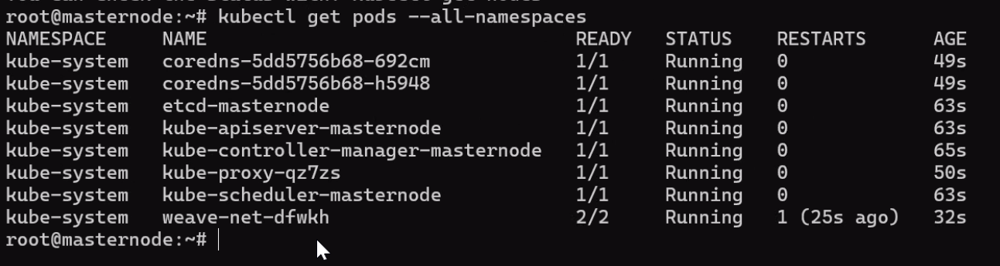
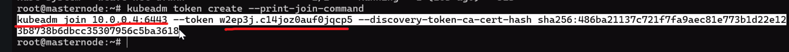
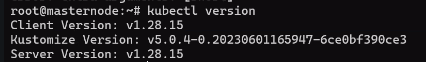
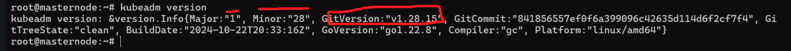
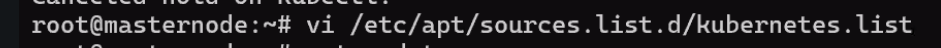
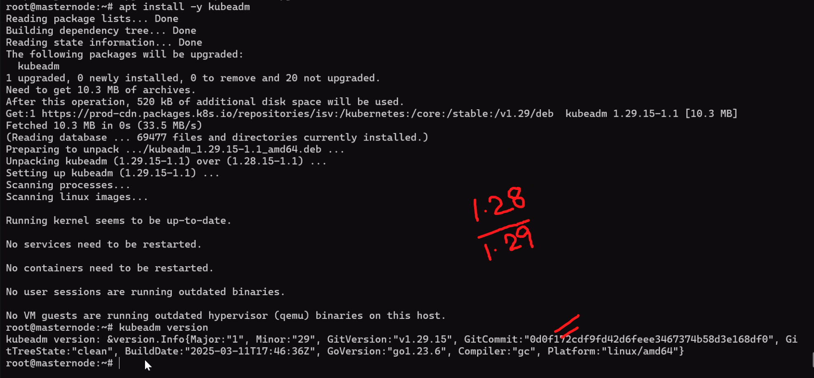

Clarification on previous day session:
In deployment, only pods will be created

Service will be attached to Deployment

Cluster IP - Only internal communication
Node >> deployment >> pod

For Every Deployment, we get service assigned
For NodePort connection, Pod in Node 1 will be connected to Pod in Node 2 using a port that gets generated at Deployment level.

Date: 09-06-2026
Agenda for today

Discussion on Complex method of Kubernetes which is 3rd method
################
To deploy in a single unit - kubernetsinstallscript.sh
kubeadm - Used to create Cluster
kubelet - To run the pods
kubectl - Command line interface to manage your entire cluster

Change the IP in line 97 for Master Node ip(Get the IP from Master Node VM)

In order to deploy a K8s in local machine, we need to disable firewall and few other
install containerd

apt-update - All metadata will be updated
Only then, we will install the software required for us
If you want to upgrade the software, we have to run upgrade commands for all components

All Nodes are working as expected. This means, Master node is working fine - 

In worder node, we should give one command which was generated from this command when I run in master node - 
root@masternode :~ # kubeadm token create -- print-join-command
kubeadm join 10.0.0.4:6443 -- token w2ep3j.c14joz0auf0jqcp5 -- discovery-token-ca-cert-hash sha256:486ba21137c721f7fa9aec81e773b1d22e12
3b8738b6dbcc35307956c5ba3618

Now, I want to upgrade the Version of Cluster
To know latest version of Kubernetes cluster - curl -s https://dl.k8s.io/release/stable.txt ====>v1.36.1

First, we will upgrade Master node, next we will upgrade all worker nodes sequentially...
Command to upgrade master node
Check --> kubectl version - 
Check --> kubeadm version - 

We have holded the kubeadm, kubectl, kubelet. So, now we have to unhold
sudo apt-mark unhold kubelet kubeadm kubectl

Edit the configuration to 1.29. So that, it will pick the version - root@masternode :~ # vi /etc/apt/sources. list.d/kubernetes.list - 

Install kubeadm - 
kubeadm upgrade apply v1.29.15

kubeadm upgrade workernode
apt-install kubelet kubectl
systemctl restart kubelet

############

Missed class here

##########

Go to master node.
To drain the node - kubectl uncordon workernode

To create another Deployment
kubectl create deployment nginx-deployment --image=nginx --replicas=50
kubectl get pods -o wide
kubectl get nodes -o wide

All the activity will be performed from Master Node only. Only for upgrades in worker node, we use worker node

If we taint, we are saying both master node and worker node act as same and we will get pods on master node as well

kind - lab environment
minikube - lab environment - this is to run in our local machine
kops - specifically for AKS to run

apt-mark showhold - To show what all components are on hold
To hold few components = sudo apt-mark hold kubelet kubeadm kubectl
To unhold few components = sudo apt-mark unhold kubelet kubeadm kubectl

Till now, we are working on Nodes, from tomorrow we will work on Pods by writing scripts for Deployments, secrets, Configmaps