Date: 11-06-2026
Agenda for today

Config Maps and Secrets.yml usage is demonstrated

Create Master Node VM
No Application related pods should run on Master Node.
Create one more Worker Node VM to create pods

Once the machine is deployed, run the script to install kubernetes
tainting means, we are telling that we will be using this Master node both for Master node operations as well as Worker Node operations
Now, lets not run the taint command. So that, Master node remains only used for Master node

We can add the worker node by running this command = 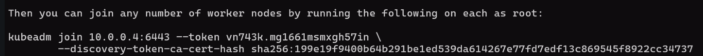

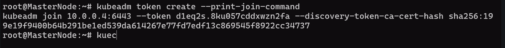 - Command to create token in Master Node

Think Namespace as a Folder for Pods as files in it.... Namespace doesnt have any capabilities other than that...
kubectl create namespace dev - Create Namespace

We can cononect o the Worker Node using the NodePort... For using NodePort, Worker Node IP:30007
We have to open the 30007 port in inbound rules in NSG for Worker Node and use Public IP:30007 to check if Nginx is owkring fine or not

In order to connect frontend to DB, we need few details
Like App name, URL, ip, DB password - These are all called Environment variables
In general, we pass these variables in runtime. But now, we will pass through a file
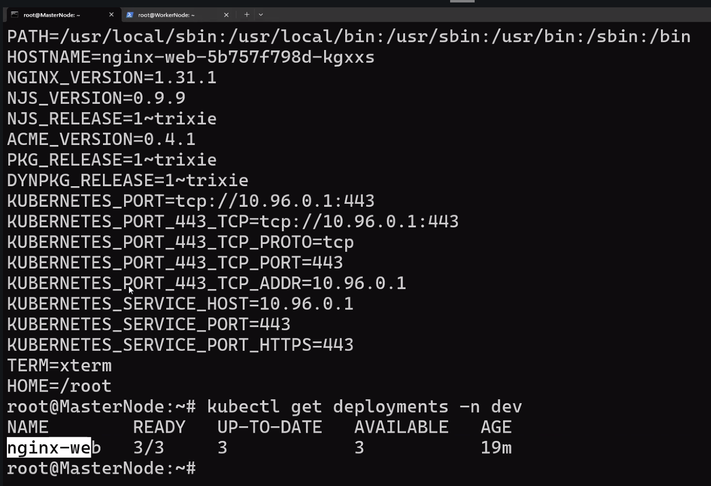
We can modify the Environment variables using Config Maps

Config map is used to store non sensitive data - configmap.yml
ConfigMap is something like variables file only
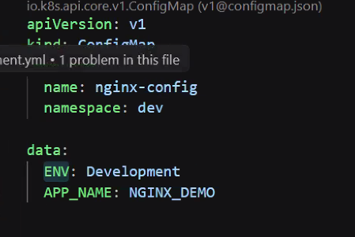
apiVersion: v1
kind: ConfigMap
metadata:
    name: nginx-config
    namespace: dev

data:
    ENV: Development
    APP_NAME: NGINX_DEMO

In deployment.yml file
First two red lines are drawn to show how explicitly variables are referred. Last red line is... directly mentioning the variables in the deployment itself. 
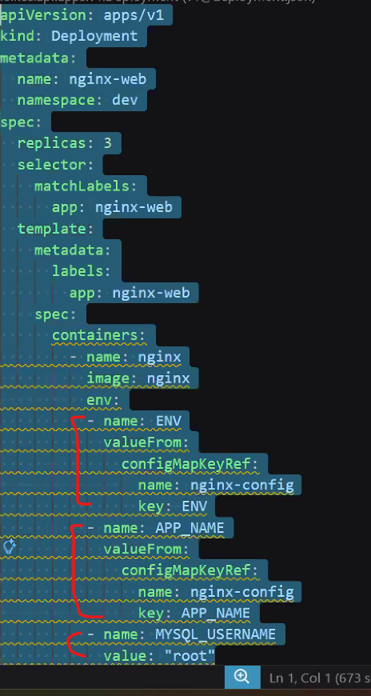

First, we should run the ConfigMap file and then run the Deployment file
With the above operations... The pods will be redeloyed

To encode a value ---> echo -n "admin" | base64
To encode a password --->echo -n "Password123" | base64

To decode -> 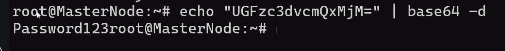

Telling Kubernetes to treat this content as unknown --> type: Opaque
secret.yml

apiVersion: v1
kind: Secret

metadata:
    name: db-secret
    namespace: dev

type: Opaque
data:
    USERNAME: yutaywu=
    PASSWORD: Password123
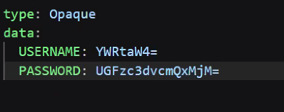

Usage in deployment.yml is 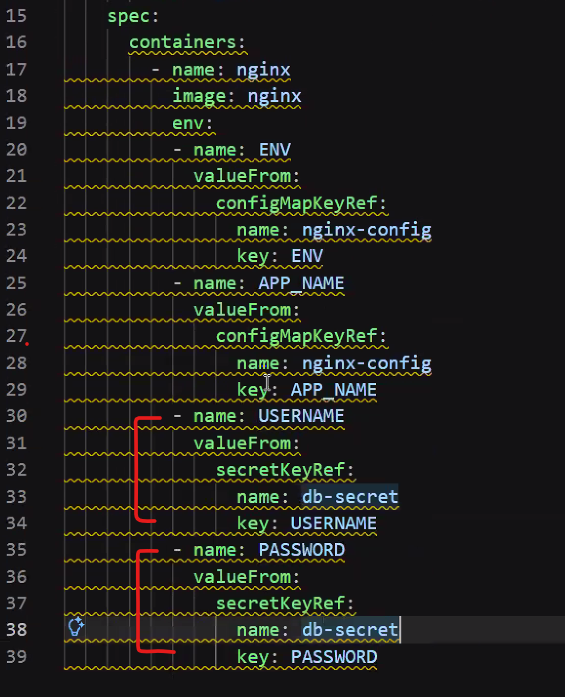

- name: USERNAME
    valueFrom:
    secretKeyRef :
    name: db-secret
        key:
- name: PASSWORD
    valueFrom:
    secretKeyRef :
    name: db-secret
    key: PASSWORD

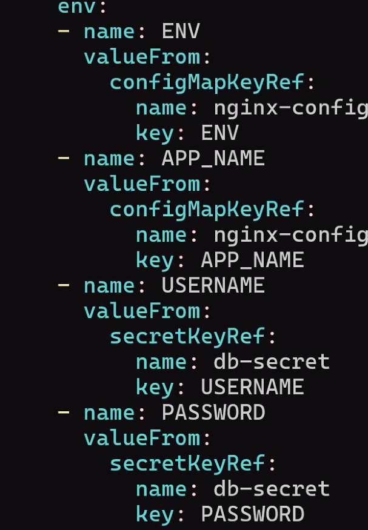

To print the Env values of a pod - 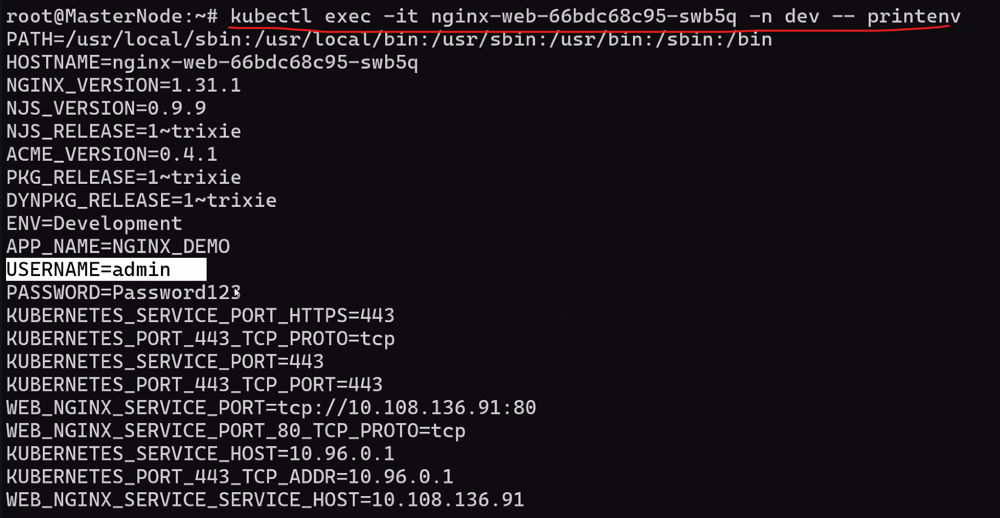
kubectl exec -it node-name -n dev -- printenv
Next, we can fetch the secrets from Key Vault using CCM - Cloud Control manager

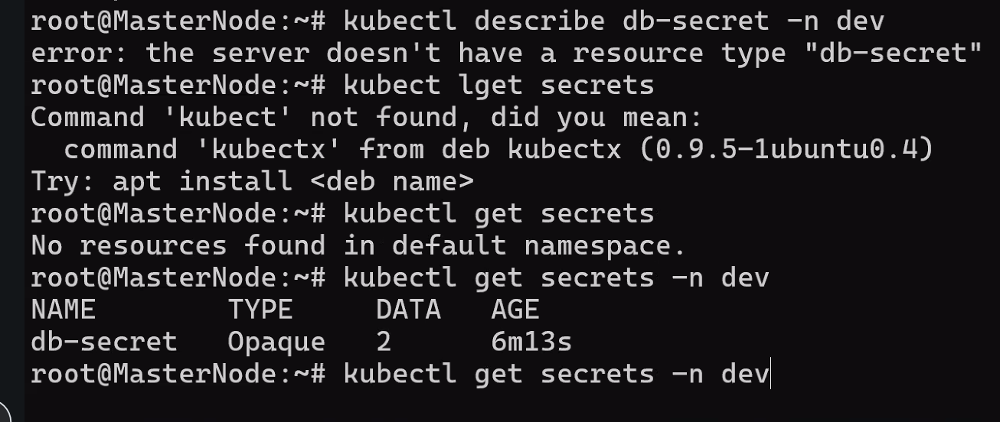
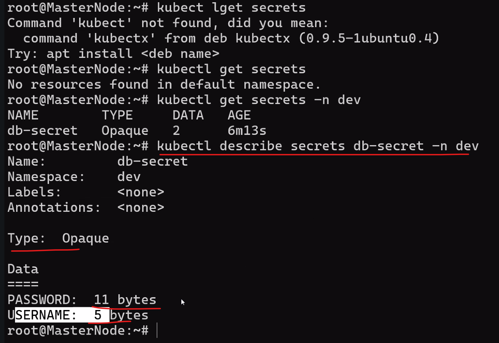

untaint chesthe - Master node is useful
taint cheshte - Master node is not useful for application purpose
