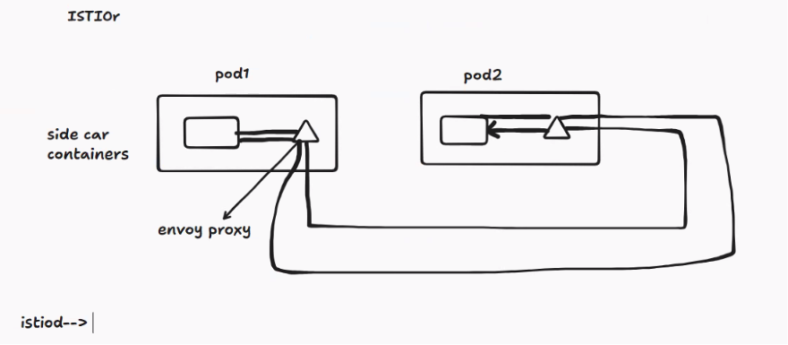
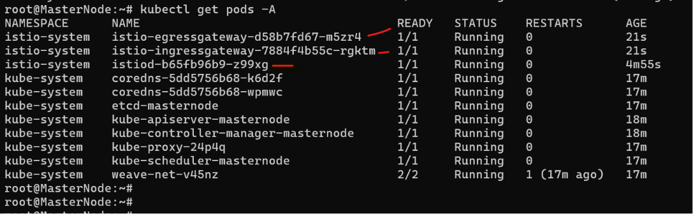
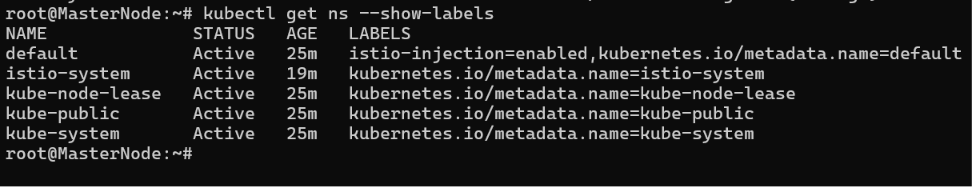
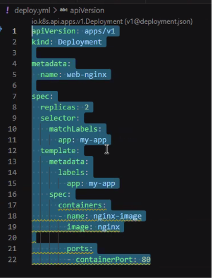
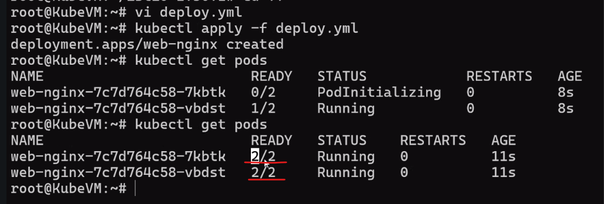
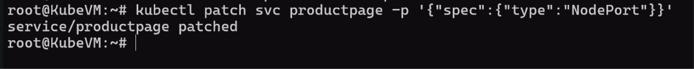

Date: 19-06-2026
Agenda for today

Security between pod to pod communcation

If pod is getting traffic in... That is called Ingress traffic
If the Pod is sending traffic out... That is called Egress traffic
We need to secure both Ingress and Egress traffic. 

We will inject a tls certificate in the pod and use that certificate to encrypt the traffic between the pods. This is called Mutual TLS (mTLS).
SSL Certificate is part of TLS. Basically, SSL certificate is transported using TLS Certificate.

North South Communication
A user communicating with the application is called North South Communication.
East West Communication
One pod communicating to another pod is called East West Communication.

envoy proxy is a tool that can be used to manage the communication between the pods. It can be used to encrypt the traffic between the pods using mTLS. It can also be used to manage the traffic routing between the pods.

ISTIO tool manages communication between the pods.

ISTIO Will create a Side car container in the pod. This sidecar container will handle all the communication between the pods. It will encrypt the traffic using mTLS and also it will manage the traffic routing between the pods - 

ISTIO will also provide observability and monitoring for the communication between the pods. It will provide metrics, logs and traces for the communication between the pods.

A Gateway is a component that will handle the ingress and egress traffic to the cluster. It will route the traffic to the appropriate service based on the rules defined in the Gateway.

Cluster >> Namespace(Loans, credit cards modules) >> Pod(login, documents) >> Container

Lets install ISTIO on MasterNode

Inject ISTIO on all the pods in the namespace - kubectl label namespace default istio-injection=enabled
It will create all sidecar containers in the pods in the default namespace.

Create a Deployment.yml - 
kubectl apply -f deployment.yml

kubectl get pods

We are getting 2 containers in the pod. One is our application container and another is the sidecar container which is injected by ISTIO.

kubectl patch svc productpage -n default -p '{"spec":{"ports":[{"port":9080,"targetPort":9080,"name":"http"}]}}'

To convert ClusterIP to NodePort we can use the following command -
kubectl patch svc productpage -p '{"spec": {"type":"NodePort"} }'
This command will patch the service to use the port 9080 which is used by the sidecar container.

How to increase the Inline suggestions limit in VS Code?
1. Open the VS Code
2. Go to 