Date: 23-06-2026
Agenda for today

In the last class,
Installed ISTIO Application on MasterNode
and make sure the pods are communicating with each other using mTLS.

We have got 3 pods - ingress, egress, istiod 
We have also installed a project called Bookinfo which has 4 microservices - productpage, details, reviews, ratings. Each microservice is running in a separate pod.

In sample project, we have 4 microservices - productpage, details, reviews, ratings. Each microservice is running in a separate pod.
Each microservice is running in a separate sidecar pod.

export PATH=$PWD/bin:$PATH
istioctl install --set profile=demo -y
kubectl get pods -n istio-system
kubectl label namespace default istio-injection=enabled
kubectl apply -f samples/bookinfo/platform/kube/bookinfo.yaml

Meanwhile, lets create a namespace and deploy apache on a pod

kubectl create namespace apache-ns
kubectl run apache-pod --image=httpd --restart=Never -n apache-ns
kubectl get pods -A

lets check the services of these pods
kubectl get svc -A

Now, to let the pods be accessible from outside the cluster, we need to create a service of type NodePort
kubectl patch svc productpage -p '{"spec": {"type" : "NodePort"}}'
kubectl patch svc ratings -p '{"spec": {"type" : "NodePort"}}'
kubectl patch svc reviews -p '{"spec": {"type" : "NodePort"}}'

Add inbound rules for these NodePorts in the security group of the cluster.
30000-33000 port
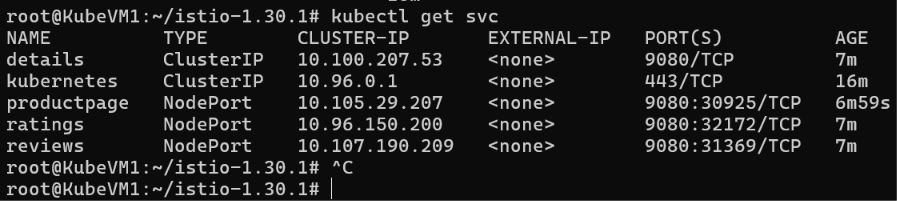
Now, lets check the NodePort of these services are working or not
http://<NodeIP>:<NodePort of productpage>
http://<NodeIP>:<NodePort of ratings>
http://<NodeIP>:<NodePort of reviews>
http://20.104.230.166:30925
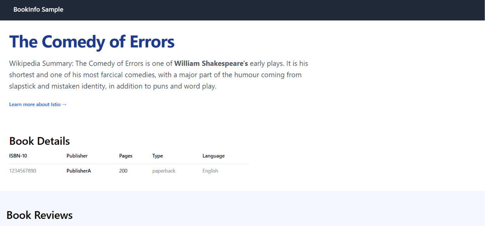

One more Pod will be created now and check if these pods are accessible or not
We havent enable the istio(mtls) mode yet. So, next, we will write a deployment file for istio for restricting the access

kubectl run curl --image=curlimages/curl -- restart=Never

kubectl run curl --image=curlimages/curl -- restart=Never -- command --sleep 365d

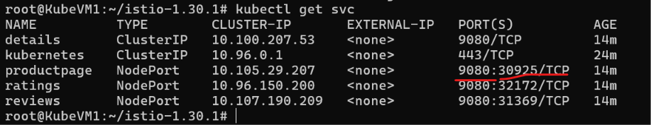
Internal port and External port

Lets check apache pod to internal pod
Running the apache server
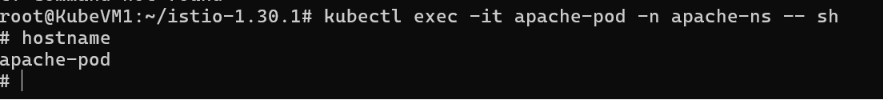

Below commands works
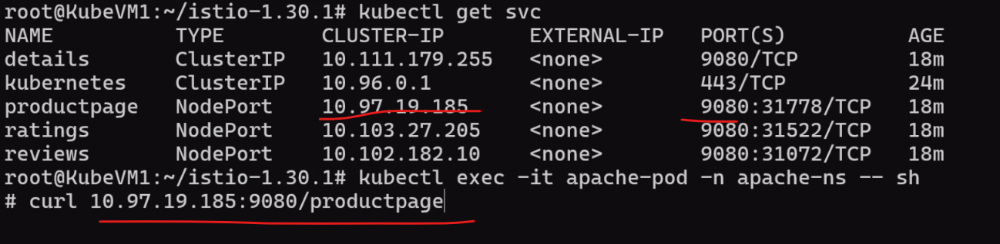

Now, these are communicating insecurely.
Now, to enable mTLS... we have to write a mtls.yml file

mTLS.yml file to enable the connection securely
apiVersion: security. istio.io/v1
kind: PeerAuthentication
metadata:
name: default
namespace: default
spec :
mtls:
mode: STRICT
To run the file
kubectl apply -f mtls.yml

kubectl get peerauthenticaltion -A
Till now, the mTLS is enabled only on Default Namespace.
Now, mTLS is not enabled on Apache pod. So, going forward, if apache server also wants to communicate with default namespace... we have to write mTLS file in apache pod and enable and then add peer authentication.

Another way to authenticate is to enable Ingress and Egress gateway.
Ingress gateway will route the traffic to pods

Pre-requisite is to Install the Kubernetes Gateway APIs
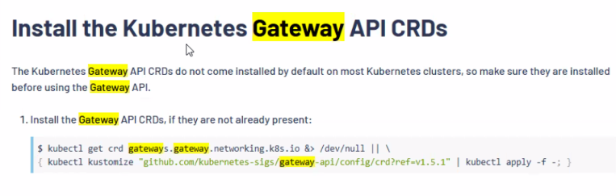

Now, we have to convert the NodePart to ClusterIP since I dont want my pods to be accessible publicly
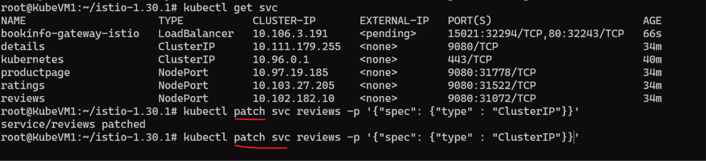
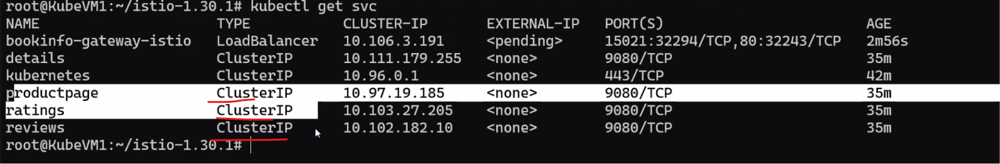

Now, we will connect to the productpage through the VM Public IP:Port of Loadbalancer
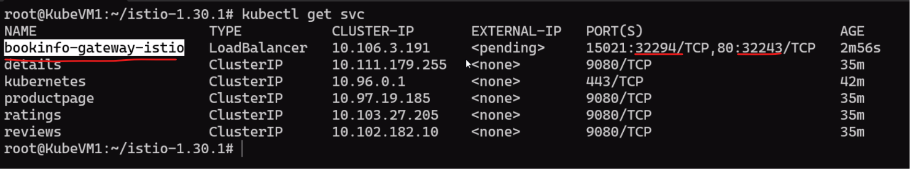

Istio will by default give access to all the tools like kiali.yml, promethus.yml
kubectl apply -f .
This will deploy all the tools inside the server
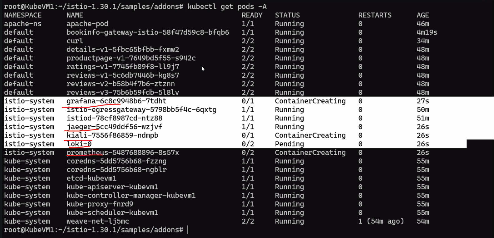

Listing all the services in the server
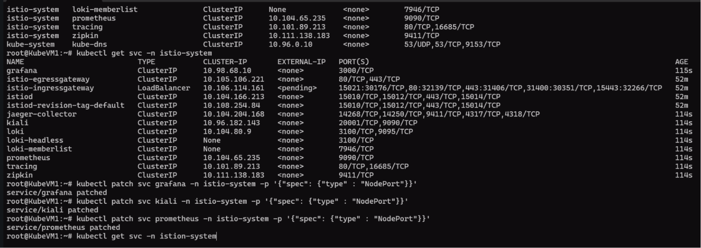

kiali = Cluster overview and traffic overview from one pod to another
Traffic graph - 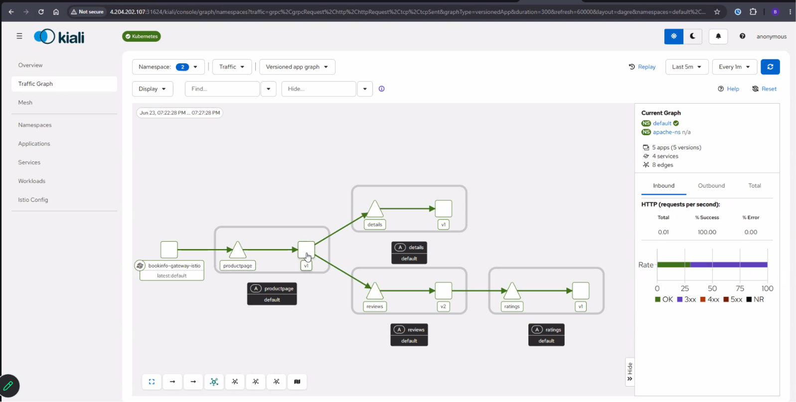

Lets generate some traffic to the server
Testing the connection
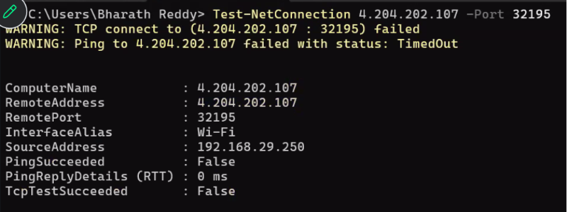
Generating the traffic
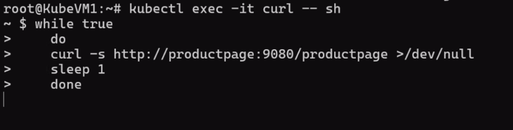
App graph looks like - 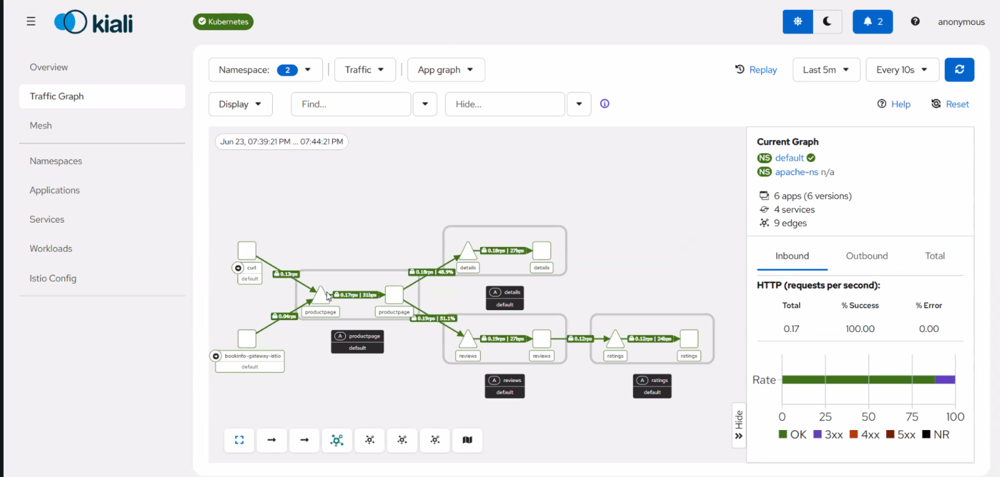
Lock is for secure connection = 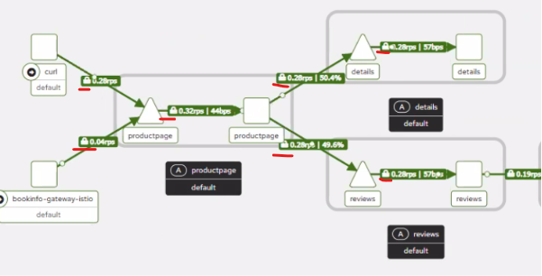

In prometheus, we get the data using query
Prometheus is deployed as part of Istio
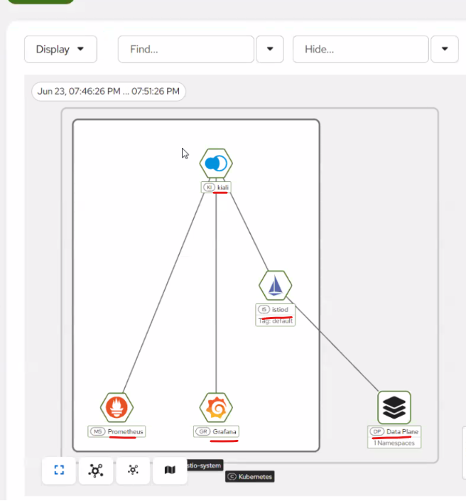

Grafana will fetch data from multiple sources and provide us dashboards
One of the source is Promotheus
For prometheus, we get data from Istio

Sumologic will collect all the logs from Azure Services and those logs will be pushed to Grafana
Splunk is also one example to collect the logs

Important Topics
Deployments
Configmaps
Services
Secrets

On every pod in a Node, our Daemon set will run
