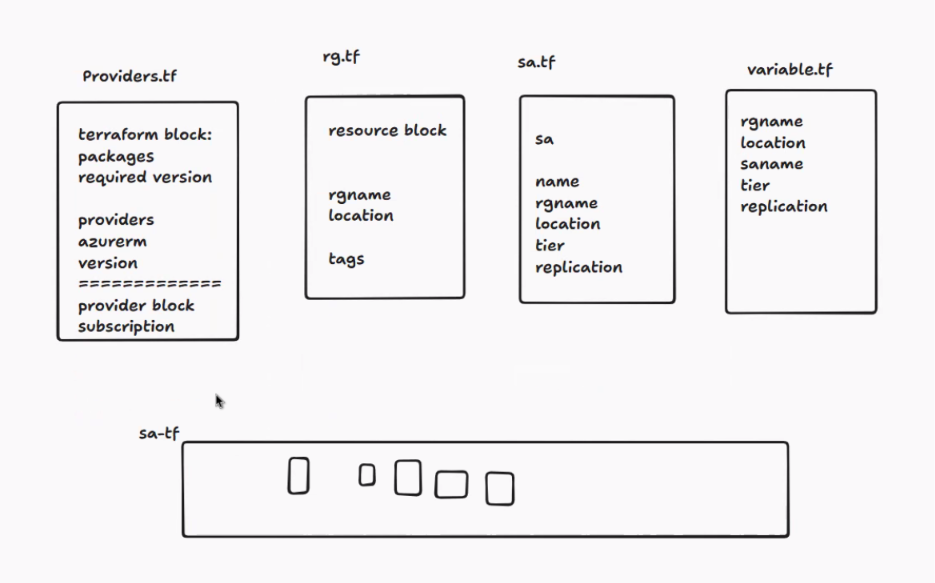

Date: 15-05-2026
Agenda for today

Terraform Statefile

Terraform Block
we have to define required version >=1.12
We should define required providers so that Terraform will connect to those Cloud operators like Azure, AWS, Kubernetes
azurerm = "hashicorp/azure"
provider = azurerm
version >= 4.0

Providers.tf - 
terraform block:
packages
required version

providers
azurerm
version

provider block
subscription

rg.tf
resource block

rgname
location

tags

sa.tf
sa
name
rgname
location
tier
replication

variables.tf
rgname
location
saname
tier
replication

terraform syntax validation
azurerm validates next

name of the resource --> destroy and recreate

Task for weekend
config configuraton for web app and app service plan
