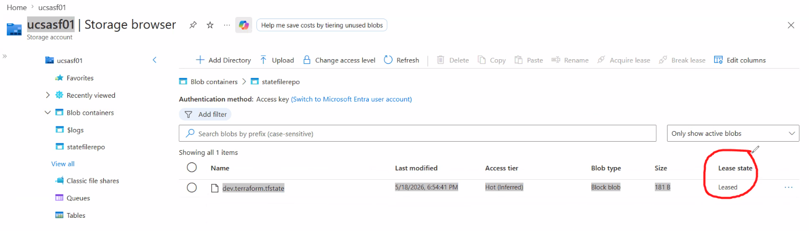
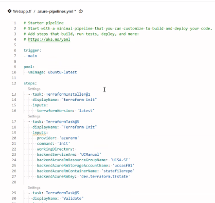
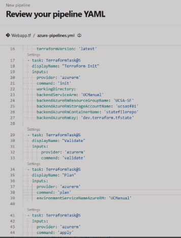
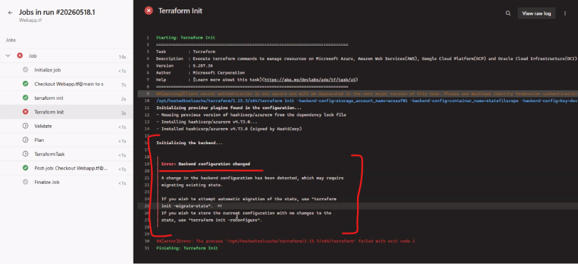
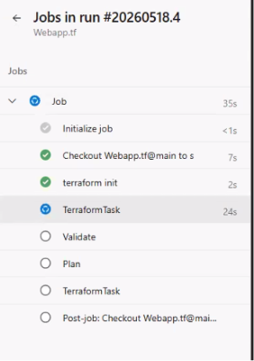

Date: 18-05-2026
Agenda for today

Terraform Statefile
We will securely store the Statefile using Terraform Backend
Examples of Remote Storages for Backend:
AWS S3 Bucket
Azure Storage Account
GCP Cloud storage

We will define the Backend in either backend.tf or in providers.tf file itself

main.tf includes
providers.tf
backend

resources.tf
rg
asp
webapp

variables.tf
rgname
location
app service plan name
webapp name
tier

CICD can only be used if providers.tf is completed

Sequence of action for today:
Create a Resource group
Create a Storage account for storing Statefile - Enable versioning for blobs in Data Protection stage, Enable Allow enabling anonymous access on individual containers
Create a Container inside Storage account - Change the access to Blob anonymous

Lease state is important - 

Steps to write in CICD Pipeline
Terraform init
Terraform validate
Terraform plan
Terraform destroy

Error while executing the Pipeline

Since we have stored the statefile from local first and then trying to run from CICD Pipeline. The error says that there is a mismatch in the backend. So, better to create a new container and avoid errors.

Stages that we have written - 
 

To remove cached .terraform ---> git rm --cached .terraform.lock.hcl
For statefiles, it is recommended to create the Storage account for Statefile and then run the terraform scripts so that the state files will be stored in Storage account

Final Achievement
We need to achieve resources should be created using modules

Tomorrow class
Meta arguments
Loops
