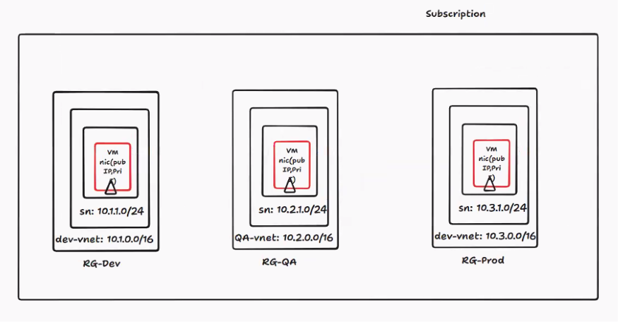
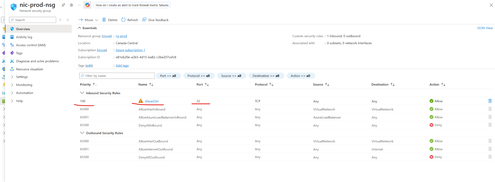
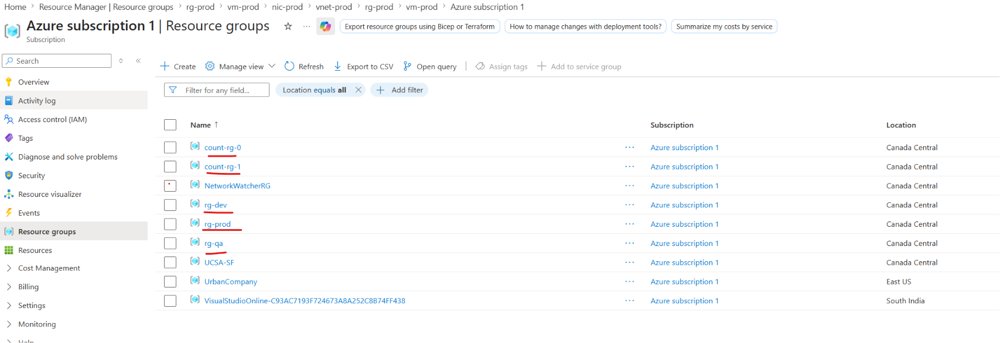
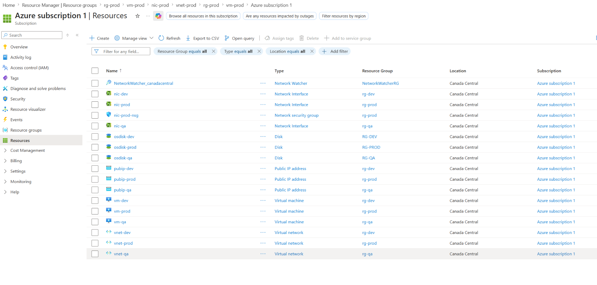
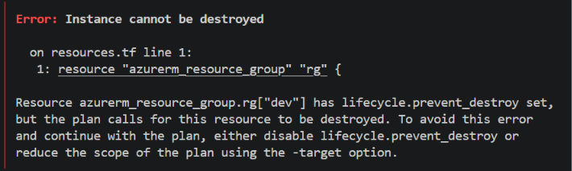

Date: 19-05-2026
Agenda for today

Look after Meta Arguments

Set of 3 Vms needs to be created - 
Subscription
Resource group
VM
NIC
Different VNets
SSH Keys needs to be generated

We will use Meta Arguments and create the above resources
Looping things:
1. for_each
2. each
3. count

for_each examples
Roll Num(key) --- Name(value)
1 : Bharath
2 : Naveen
3 : Keerthi
each.key ---> 1,2,3
each.value ---> Bharath, Naveen, Keerthi

For our use case of 3 Vms
dev = Standard_B1ms
qa = Standard_B1ms
prod = Standard_B2ms

We will create variables.tf, providers.tf, resource.tf
Created a Project folder with Virtual machines in this call

In every resource block, declare the for_each block

for_each = var.environments
name = var-${each.key}
vm_size = ${each.value}

Doubt - When to use square bracket? When to use flower bracket?
Example : resource_group_name = azurerm_resource_group.rg[each.key].name
name = "vnet-${each.key}"
Answer:
While calling other block - []
new resource - {}

Allowed SSH to the VMs to test the connectivity - 

As part of todays class - These resource groups are created - 
These are the resources that are created - 

Since prevent_destroy = true - While doing terraform destroy command.. this error came - 

Homework
Create NSG and add to all VMs